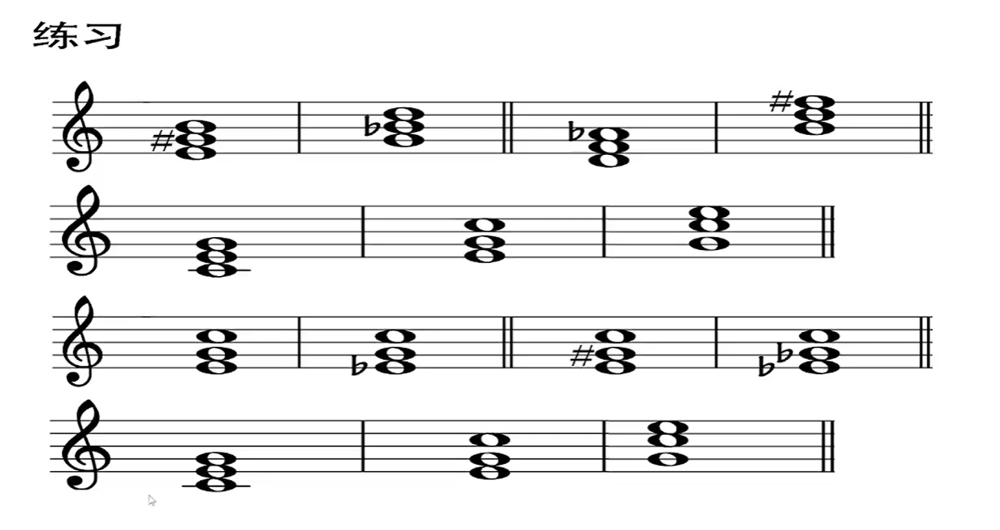
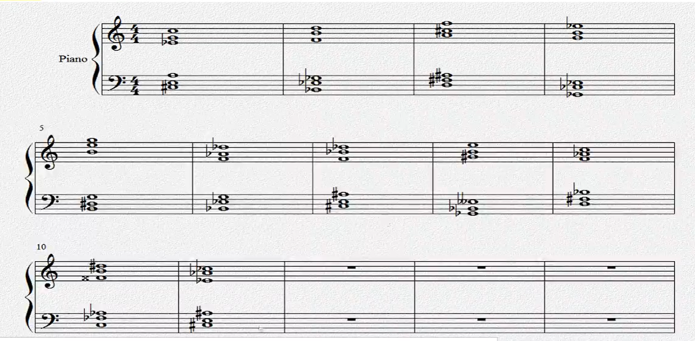

[第十一节 三和弦的转位.pptx](https://www.yuque.com/attachments/yuque/0/2022/pptx/12393765/1662994685674-7e38775c-fe42-4944-9ccc-3c3a93f64d4d.pptx)
# 作业
> 
> - E, Gm, D-, Bm
> - C, C/E, C/G
> - C/E, Cm/bE, C+/E, C-/bE
> - C, C/E, C/G
> 

> **高音区: **
> - Cm/bE, B-/F, F+/A, bE+/G
> - Em/B, bD/F, bBm/F, E/#G, Fm
> - B+/xF, bAm/bE
> 
**低音区: **
> - A/#C，bEm/bB, D+, bC/bG, 
> - G+/B, bE/bB, #A-/#C, bbE+/bB, bB+/D
> - bF+/C, #A-/#C

