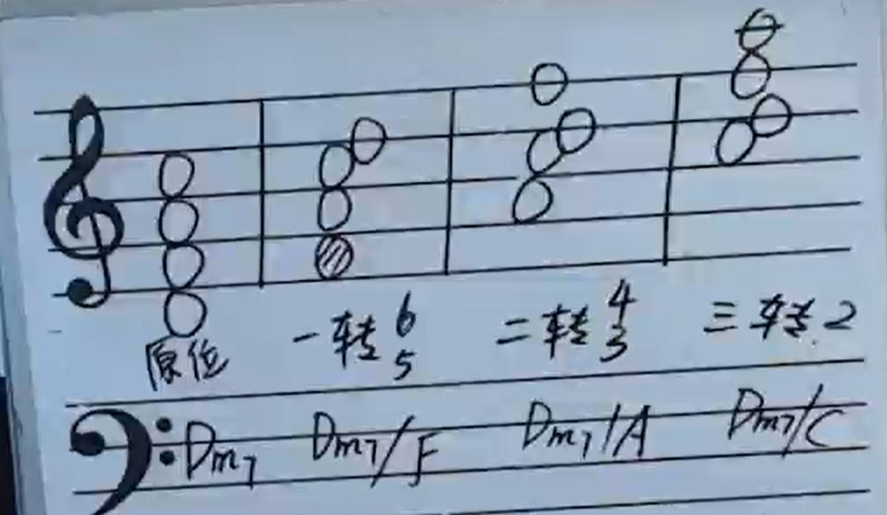
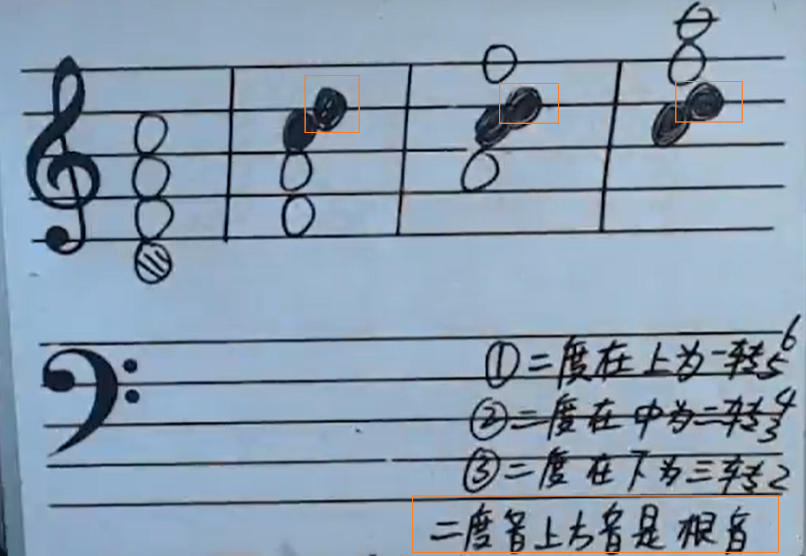
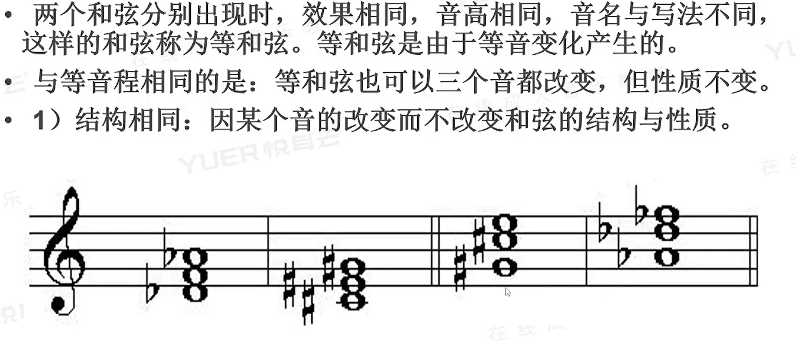
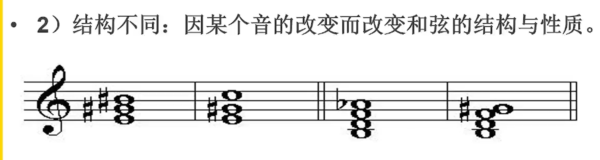
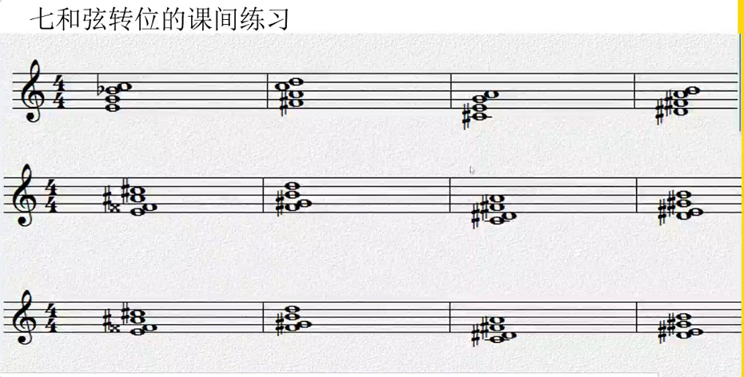
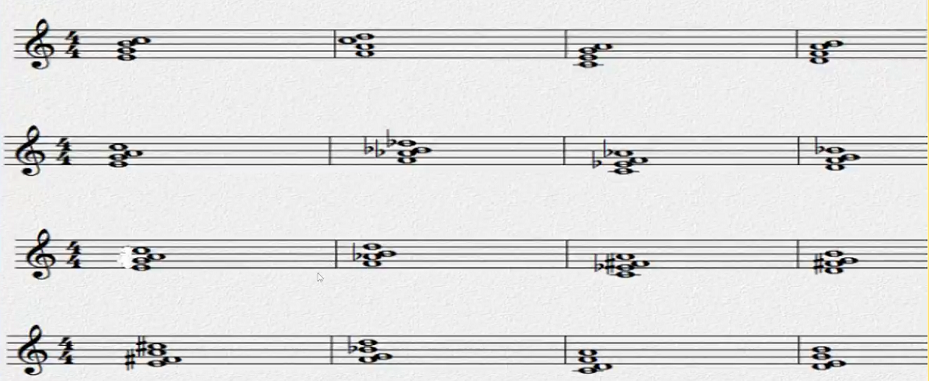

[第十三节 七和弦的转位.pptx](https://www.yuque.com/attachments/yuque/0/2022/pptx/12393765/1663655001879-2521ee42-67e0-48fb-98ca-382c3500a549.pptx)
# 1 七和弦的转位
## 1.1 不同种类的转位
> 

## 1.2 快速判断是多少转位
> 

# 2 等和弦
> 
> 

# 3 协和性
> 

# 4 作业
> 
> - $C_{7}/E$, $D_{7}/^{\#}F$, $A_{7}/^{\#}C$, $B_7/^{\#} D$
> - $^{x}F_{dim 7}/E$, $^{\#}G_{dim 7}/F$, $^{\#}D_{dim 7}/C$, $^{\#}E_{dim 7}/D$
> - 和上面一行一样
> 

> - $C_{maj7}/E$, $D_{m7}/F$, $A_{m7}/C$, $B_{m7-5}/D$
> - $A_{m7}/E$, $^{b}B_{m7}/F$, $F_7/C$, $G_{m7}/D$
> - $A_{m7}/E$, $B_{dim 7}/F$, $^{\#}F_{dim 7}/C$, $G_{maj7}/D$
> - $^{\#}F_{m7}/E$, $G_7/F$, $D_{m7}/C$, $E_{m7}/D$

