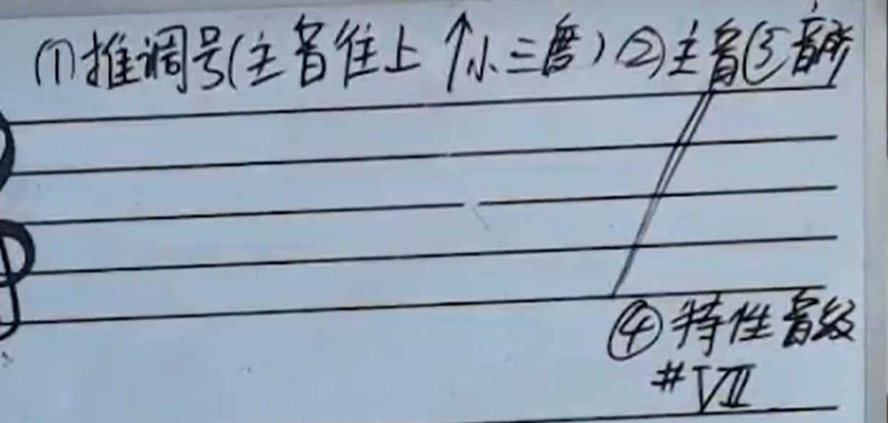
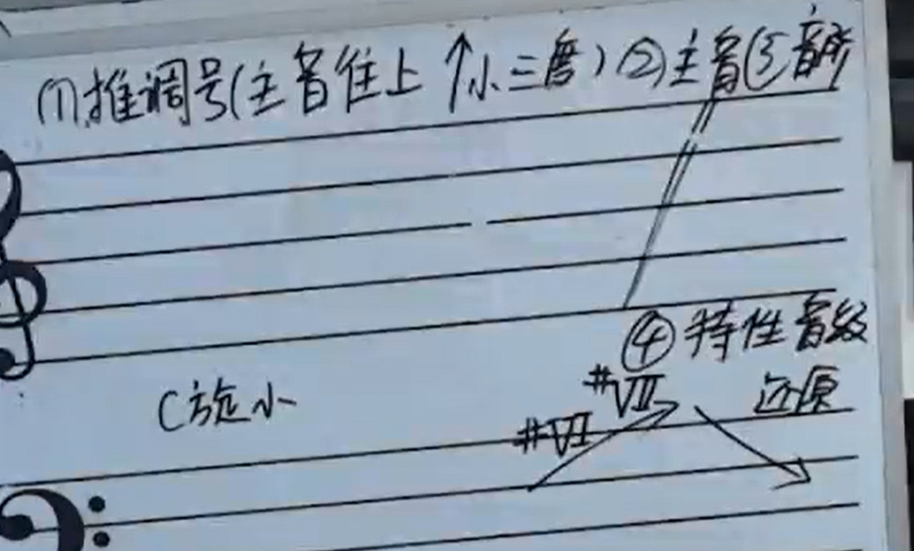
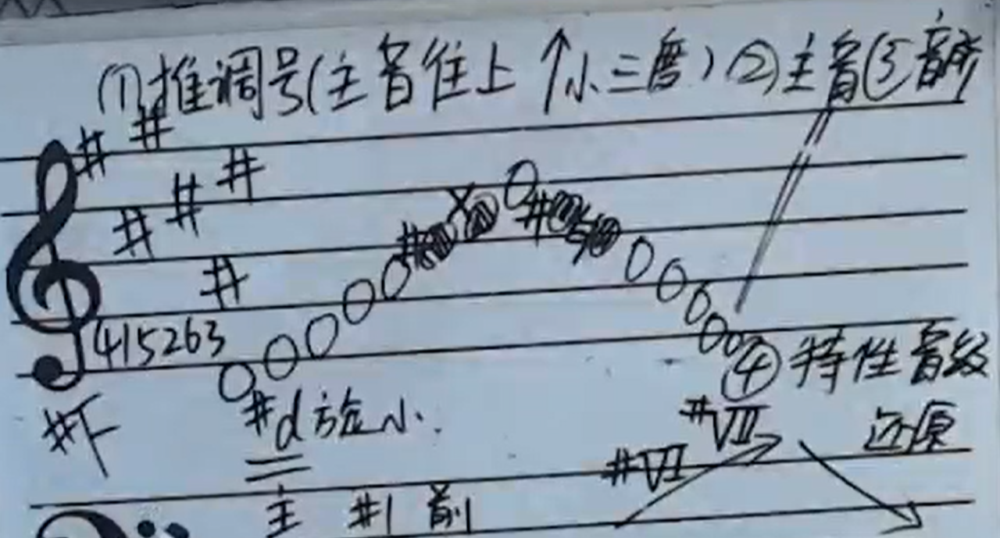
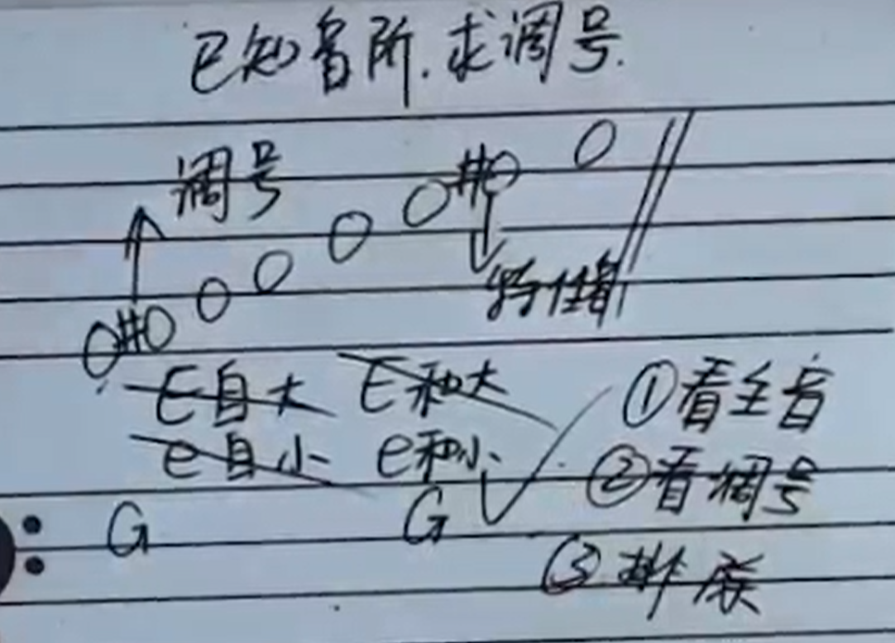

[第十九节 调式调性小调式.pptx](https://www.yuque.com/attachments/yuque/0/2022/pptx/12393765/1665031938983-0e4116aa-f4f1-4411-b81a-03a688ac62f3.pptx)
# 1 自然小调
:::info
和大调的根音之间相差一个小三度。
:::

# 2 和声小调
:::info

如果遇到诸如和小, 先往上找一个小三度，是和大，然后根据在和大的基础上，对的的特性音级进行升降操作。
:::

# 3 旋律小调
:::info
还原成调号原来的样子
例子:

:::

# 4 拓展题
:::info

:::
