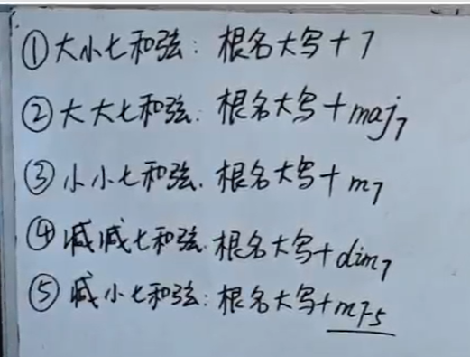
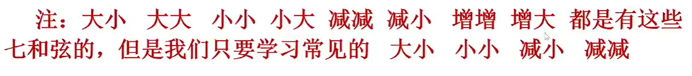
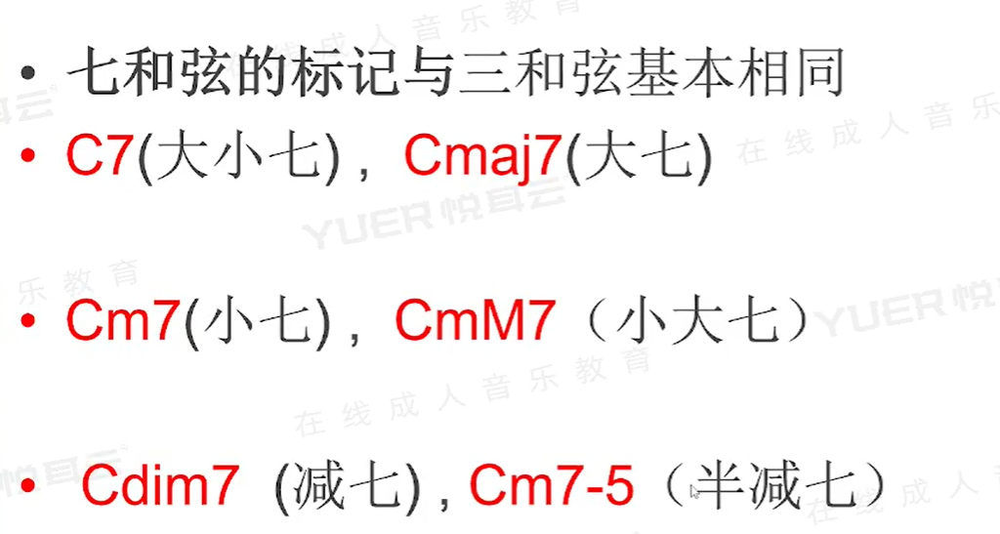
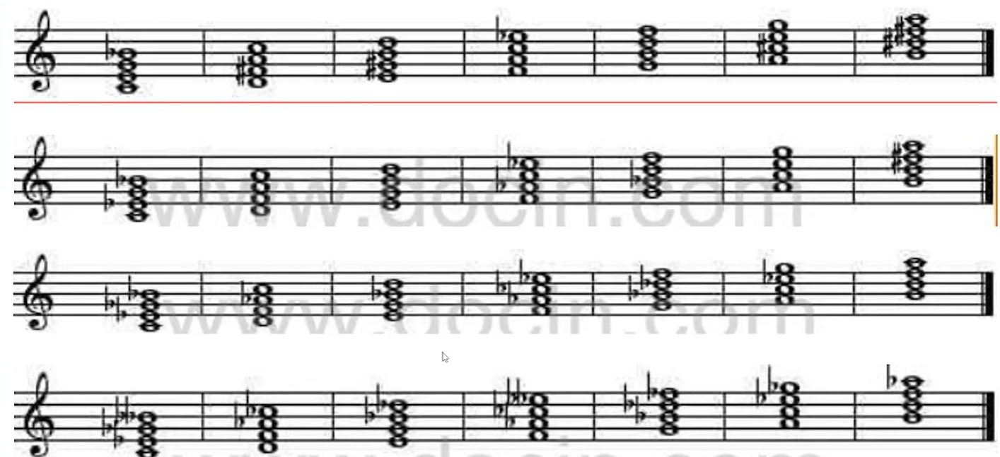
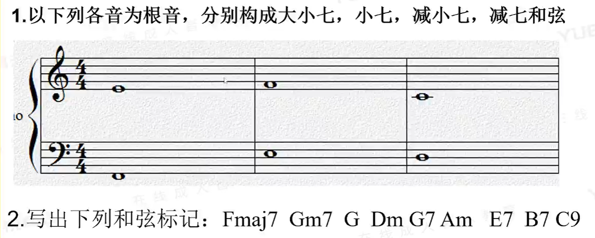

[第十二节 七和弦.pptx](https://www.yuque.com/attachments/yuque/0/2022/pptx/12393765/1663168572118-618517d5-2e1a-4186-985b-54107f811e4f.pptx)
# 1 七和弦
:::info

**常用七和弦的解题步骤：**

1. 先计算**前三个音组成的三和弦**名称（大三/小三/减三）
2. 计算**七音和根音的转位之间的二度关系**(小二/大二/增二), 然后得到**七音和根音**之间的七度(大七/小七/减七)
3. 拼接得到的和弦名称。

:::

# 2 九和弦
> 
> 

# 3 作业
> 
> 
> **第一题:**
> 1. ($E, \#G, B, D$), 
> 2. $(F,^bA,C, ^bE)$, $(C,^b E,^b G, D)$, $()$, $()$, $()$。
> 

