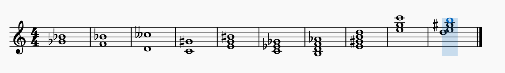
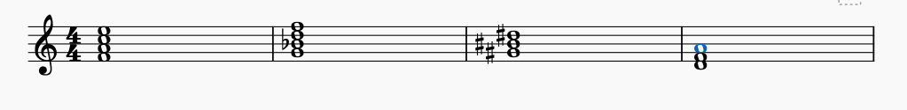
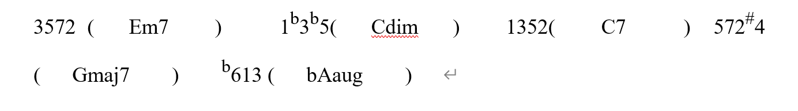

# 1 节奏型
## 1.1 单拍子
:::info
所有分子是$2,3$的
:::

## 1.2 复拍子
> 由两个或者两个以上相同类型的单拍子组成的，$\frac{4}{4}$,$\frac{4}{2}$, $\frac{6}{8}$。分子是$3$的倍数

## 1.3 混合拍子
:::info
由两个或者两个以上不同类型， 比如$\frac{5}{8}, \frac{5}{4}$

- 先后: 变换
- 同时: 交错(多声部)
:::

## 1.4  自有拍子
:::info
除了以上三种都是自由拍子。
:::

# 7 音程和七和弦
> 纯四度，小七度，减五度，纯八度
> $C_{m7}$, $E_7$, $^{\#}G_{m7-5}$, $B_{dim 7}$

# 8 根音构出音程，和弦
> 

# 9 写出三和弦的原位和弦
> **第一个：**
> - 原位$C_{m}$， 称为小三和弦
> - 第一转位 $C_{m}/^bE$,  也称为小6和弦
> - 第二转位 $C_m/G$, 也称为小46和弦
> 
**第二个:**
> - 原位$E$, 也称为大三和弦
> - 第一转位 $E/^{\#}G$, 也称为大6和弦
> - 第二转位 $E/B$, 也称为大46和弦
> 
**第三个：**
> - 原位 $G$, 也称为大三和弦
> - 第一转位 $G/B$, 也称为大6和弦
> - 第二转位 $G/D$, 也称为大46和弦
> 
**第四个:**
> - 原位 $B_{dim}$, 也称为减三和弦
> - 第一转位 $B_{dim}/D$, 也称为减6和弦
> - 第二转位 $B_{dim}/F$, 也称为减46和弦

# 10 和弦标记的组成音
> 
> $F,A,C,E$
> $G, ^b B,D,F$
> $^{\#} G ^{\#} B ^{\#} D$
> $D,F,A$

# 11 根据和弦组成音写出对应和弦标记
> 

