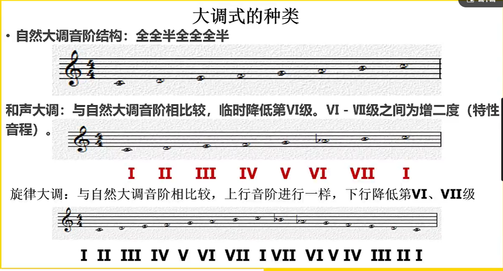

[第十八节 调式调性大调式.pptx](https://www.yuque.com/attachments/yuque/0/2022/pptx/12393765/1664452421360-3060a9a5-66a0-4c79-8770-7abb76cc5cf1.pptx)
# 1 自然音阶
> 

# 2 和声大调
> 

# 3 上行/下行音阶（旋大）
> 
> 上行不变，下行降六，七级。
> 旋大有上行和下行。

# 4 概念汇总
> 

# 5 作业
> 

