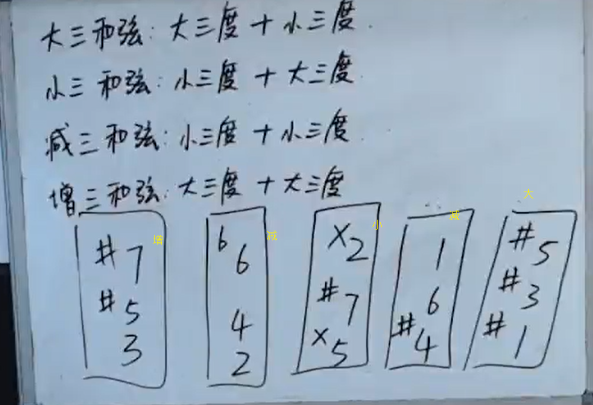

[第十节 三和弦.pptx](https://www.yuque.com/attachments/yuque/0/2022/pptx/12393765/1663674551104-119761e8-737d-4791-99b3-fd6ef24fbd9f.pptx)
# 1 三和弦
> 

# 2 协和和弦
> 

# 3 作业
> 

> 1. 高音区: Dm, F, E+, B-, #D, G-, bB
> 
低音区: Am, D, bBm, bG, Dm, B, #Am
> 2. (F,A,C), (G,bB, D), (G,B,D),(D,F,A),(A,#C, E), (#B, xD, #F) ,(C,bE,G), (bD, bF,bbA), (A,C,#E)

