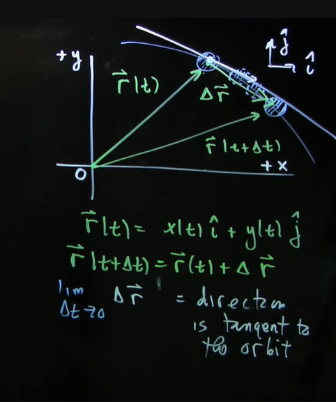
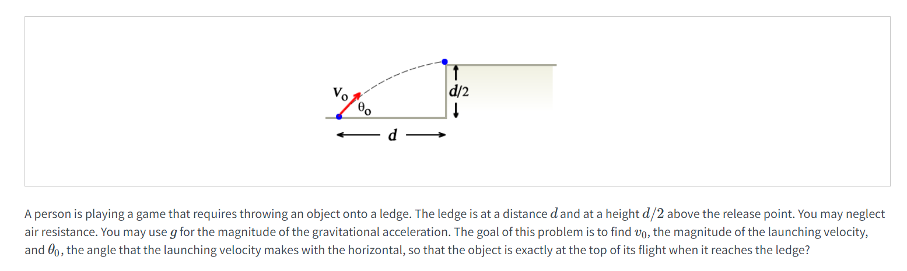

# 1 二维空间运动的描述
[Introduction to the Vector Description of Motion in Two Dimension.pdf](https://www.yuque.com/attachments/yuque/0/2022/pdf/12393765/1661419938159-c30f68b7-dc8f-49df-8982-f3df4082649b.pdf)
## 1.1 坐标向量
> 

## 1.2 瞬时速度
> 
> 
> 然后我们有: $\Delta \mathbf{\vec{r}}=\Delta x\hat{i}+\Delta y\hat{j}$, $\mathbf {\vec{v}}=\lim_{\Delta t\to 0}\frac{\Delta \mathbf{\vec{r}}}{\Delta t}=\lim_{\Delta t\to 0}\frac{\Delta x}{\Delta t}\hat{i}+\lim_{\Delta t\to 0}\frac{\Delta y}{\Delta t}\hat{j}=\frac{dx}{dt}\hat{i}+\frac{dy}{dt}\hat{j}=v_x\hat{i}+v_y\hat{j}$
> 瞬时速度大小：
> $|\mathbf{\vec{v}}|=\sqrt{v_x^2+v_y^2}$
> 瞬时速度方向：
> $\theta=tan^{-1}(\frac{v_y}{v_x})$

## 1.3 瞬时加速度
> 
> $\vec{a}(t)=\frac{d\vec{v}}{dt}=\lim_{\Delta t\to 0}\frac{\Delta \vec{v}}{\Delta t}$, $\Delta \vec{v}=\vec{v}(t_2)-\vec{v}(t_1)$
> 
> $\mathbf {\vec{v}}=v_x\hat{i}+v_y\hat{j}$
> $\vec{a}=\frac{dv_x}{dt^2}\hat{i}+\frac{dv_y}{dt^2}\hat{j}=\frac{d^2x}{dt^2}\hat{i}+\frac{d^2y}{dt^2}\hat{j}$
> 所以$\begin{cases} {a}_x=\frac{dv_x}{dt}=\frac{d^2x}{dt^2}\\{a}_y=\frac{dv_y}{dt}=\frac{d^2y}{dt^2}\end{cases}$

# 2 抛物运动完整分析
[Projectile Motion.pdf](https://www.yuque.com/attachments/yuque/0/2022/pdf/12393765/1661419938888-35f24212-b7e0-4464-9e57-b548b1826ff9.pdf)
> 本小节将介绍一个重要的运动: 抛物运动，之所以称为抛物运动，是因为质点运动的轨迹近似为一个抛物线。

> 

## 2.1 建立坐标系
> 
> 
> 

## 2.2 初始条件
> 
> 1. **速度矢量**$\mathbf{\vec {v_0}}$**分解：**
> 

> 
> 2. $\theta_0$**的三角函数表达式：**
> 

> 3. **初始位置表达式：**
> 

## 2.3 受力分析
> 
> 

## 2.4 运动方程
> 1. **使用牛顿第二定律**
> 

> 
> 2. **力的不同方向的分解**
> 

> 因为$x$方向上物体没有受到力的作用，所以$a_x=0$
> 
> 
> 因为$y$轴正方向上物体受到了一个竖直向下的重力作用，所以$a_y=-g<0$
> 3. **对加速度和速度积分求出物体在**$x$**和**$y$**轴的速度变化函数和位移变化函数：**
>    1. $x$**轴方向**
>    2. $y$**轴方向**
> 4. **完整的结果**
> 

## 2.5 算例
> 

**(a)**假设石头用了$t_1$的时间到达最高点，则：

**(b)**我们在竖直方向上使用匀加速直线运动公式：$y(t)=y_0+v_{y,0}t-\frac{1}{2}gt^2,y_0=2m,v_{y,0}=v_0sin(\theta_0),\\\theta_0=45\degree, v_0=20m\cdot s^{-1}$
所以, 我们可以得到：

## 2.6 演示
> [https://openlearninglibrary.mit.edu/courses/course-v1:MITx+8.01.1x+3T2018/courseware/week:week1/ls:ls_01_04/?child=first](https://openlearninglibrary.mit.edu/courses/course-v1:MITx+8.01.1x+3T2018/courseware/week:week1/ls:ls_01_04/?child=first)

# 3 轨道方程
## 3.0 前言
> 前文我们在分析一个质点的运动的时候，在描述其物理量: **加速度，速度，和位移**的时候往往都是使用$\mathbf{\vec{a}(t)}$, $\mathbf{\vec{v}(t)}$, $\mathbf{\vec{x}(t)}$来描述，换句话说，都是和$t$有关的，本小节我们将尝试将$t$变量消去，得到轨道方程

## 3.1 轨道方程和推导
> 这是我们的轨道方程的最终结果
> 
> 下面我们给出分步推导过程：

**y(t)和x(t)消去t**我们从$x$方向的位移$x(t)$开始, 解出$t$:

将$t$代入$y(t)$的表达式：

得到:

将其展开, 得到$y(t)$关于$x(t)$的函数:

如果初始$t=0$, $x_0=0,y_0=0$, 则$(5.1.28)$最终会被化简成：

**得到速度向量大小v(t)和方向**
令$\theta$为速度方向和$x$正方向张成的夹角, 则:

为了求出$\frac{dy}{dx}$, 我们对$(5.1.28)$两侧进行求导:

所以在$(x(t),y(t))$处的速度方向与$x$轴正方向的夹角$\theta$为:

## 3.2 算例
> 
> 

**图示**
**(a)**
**(b)**
**(c)**研究`Pail`的运动方程求解会更容易一下，所以最终的结果是：

# 4 Mini Quizzes
## Q1 坐标系的选取
> 

**Part a**
**Part b**
**Part c**
**Part d**
**Part e**

## Q2 路程和位移
> 

**Key**

## Q3 平均速率和平均速度
> 

**Key**

## Q4 瞬时速度和速率
> 

**Key**

## Q5 抛物运动
> 
> 
> 
> 

**Key**根据题意我们有$\begin{cases} v_0sin(\theta_0)-gt=0 ................................................(1)\\ v_0cos(\theta_0)t=d......................................................(2)\\ v_0sin(\theta_0)t-\frac{1}{2}gt^2=\frac{d}{2}...........................................(3)\end{cases}$
我们联立$(1),(2)$: 得到$v_0^2sin(\theta_0)cos(\theta_0)=gd..................................(4)$
联立$(1),(3)$: 得到$v_0^2sin^2(\theta_0)=gd..................................................(5)$
联立$(4),(5)$: 得到: $sin^2(\theta_0)=sin(\theta_0)cos(\theta_0)$, 所以$sin(\theta_0)=cos(\theta_0)$, 所以$sin(\theta_0+45\degree)=0, \theta_0\in [0\degree,90\degree]$, **所以**$\theta_0=45\degree$
**回代**$(5)$**, 得到**$v_0=\sqrt{2gd}$
然后我们需要求出物体到达`ledge`之后的初速度，$v=\frac{\sqrt{2}}{2}v_0$, 由于物体在水平方向只收到常阻力，不妨设为$a_x$, $\begin{cases}v-a_xt=0\\vt-\frac{1}{2}at^2=s \end{cases}$, 解得$|a_x|=\frac{v^2}{2s}=\frac{v_0^2}{4s}$

