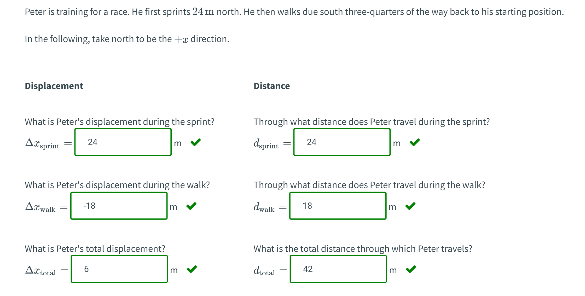
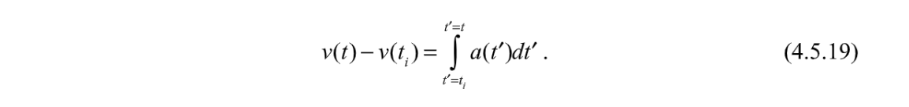

# 1 位置，时间和位移
[Position, Time Interval, Displacement.pdf](https://www.yuque.com/attachments/yuque/0/2022/pdf/12393765/1661179716303-d77b3145-c4fe-4d04-9777-2e9717c68a41.pdf)

## 1.1 Coordinate System
> 
> 假设我们想要描述图中这个小人的运动情况，包括其运动速度，加速度等，则我们需要建立一个(笛卡尔)坐标系统(`Coordinate System`)来描述。
> 一个坐标系统包括:
> 1. 原点(`Origin`)
> 2. 坐标轴(`Axis`) 
> 3. 正方向(`Positive Coordinate Direction`)
> 4. 单位坐标向量(`Unit Vector`)，长度为$1$, 方向为坐标轴的正方向
> 

## 1.2 Position Vector
> 
> 上图中$\mathbf{\vec{r}}(t)$是我们在多元微分中学习的向量函数，在`1D Kinematics`中$\mathbf{\vec{r}}(t)=x(t)\mathbf{\hat{i}}$
> 其中, $\mathbf{\vec{r}}(t)$是`Position Vector`,$x(t)$称为`Component of Position vector`, $\mathbf{\hat{i}}$就是$x$轴正方向的单位方向向量, 对于$x(t)$, 我们可以讨论$x(t)$的正负性:
> 

## 1.3 Displacement Vector in 1D
> 
> 
> - 位移$\Delta \mathbf{\vec{r}}$是一个向量，$\Delta x(t)$是`Component of the displacement vector`, 如果$\Delta x>0$，则小人在$\Delta t$时间内向$x$轴正方向移动。
> - $\Delta x<0$，则小人在$\Delta t$时间内向$x$轴负方向移动。
> - $\Delta x=0$，则小人在$\Delta t$时间内没有移动。

## 1.4 Mini Quizzes
> 

# 2 速度
[Velocity.pdf](https://www.yuque.com/attachments/yuque/0/2022/pdf/12393765/1661179716602-c6f42ae6-d972-4abc-b4a4-d3e10ce8217a.pdf)
## 2.1 一维平均速度Average Velocity
> 平均速度的描述了在$\Delta t$的时间内，位移的变化量

> 假设在$t$时刻，质点的坐标向量是$\mathbf{\vec r}(t)=x(t)\mathbf{\hat{i}}$, 经过$\Delta t$时间后，质点处于$\mathbf{\vec r}(t+\Delta t)=x(t+\Delta t)\mathbf{\hat{i}}$, 则我们的平均速度向量定义为$\mathbf{\vec{v}_{ave}}=\frac{\mathbf{\vec r}(t+\Delta t)-\mathbf{\vec r}(t)}{\Delta t}$, 注意$\Delta t$不一定要趋近于零，因为我们的$\Delta t$可能会很大。

> 观察$\mathbf{\vec{v}_{ave}}=\frac{\mathbf{\vec r}(t+\Delta t)-\mathbf{\vec r}(t)}{\Delta t}$，我们进行化简：
> $\mathbf{\vec{v}_{ave}}=\frac{\mathbf{\vec r}(t+\Delta t)-\mathbf{\vec r}(t)}{\Delta t}=\frac{x(t+\Delta t)-x(t)}{\Delta t}\mathbf{\hat{i}}=\frac{\Delta x}{\Delta t}\mathbf{\hat{i}}$, 单位是$m\cdot s^{-1}$
> 其中$\frac{\Delta x}{\Delta t}$是`Component of average velocity vector`。
> 我们可以令$v_{avg}=\frac{\Delta x}{\Delta t}$, 表示这个`Component`, 这是一个标量值，因为$\mathbf{\hat {i}}$的长度为$1$, 所以，$v_{avg}$实际上反应了平均速度的大小，没有任何方向信息。 

## 2.2 一维平均速率Average Speed
> 平均速率的描述了在$\Delta t$的时间内，路程的变化量

> 和`Average Velocity`的定义类似，只是我们不再以位移作为质点移动的描述，而是以路程作为质点移动的描述，所以定义为: $\frac{d}{\Delta t}$, 单位是$m\cdot s^{-1}$

## 2.3 一维瞬时速度
> 和平均速度的定义类似:
> 假设在$t$时刻，质点的坐标向量是$\mathbf{\vec r}(t)=x(t)\mathbf{\hat{i}}$, 经过$\Delta t$时间后，质点处于$\mathbf{\vec r}(t+\Delta t)=x(t+\Delta t)\mathbf{\hat{i}}$, 则我们的瞬时向量定义为$\mathbf{\vec{v}_{inst}}=\lim_{\Delta t\to 0}\frac{\mathbf{\vec r}(t+\Delta t)-\mathbf{\vec r}(t)}{\Delta t}$, 注意$\Delta t$要趋近于零，因为我们的$\Delta t$是一个极小量。

> 
> 观察$\mathbf{\vec{v}_{inst}}=\lim_{\Delta t\to 0}\frac{\mathbf{\vec r}(t+\Delta t)-\mathbf{\vec r}(t)}{\Delta t}$，我们进行化简：
> $\mathbf{\vec{v}_{inst}}=\lim_{\Delta t\to 0}\frac{\mathbf{\vec r}(t+\Delta t)-\mathbf{\vec r}(t)}{\Delta t}=\lim_{\Delta t\to 0}\frac{x(t+\Delta t)-x(t)}{\Delta t}\mathbf{\hat{i}}=\lim_{\Delta t\to 0}\frac{\Delta x}{\Delta t}\mathbf{\hat{i}}=\frac{dx}{dt}\mathbf{\hat{i}}$, 单位是$m\cdot s^{-1}$
> 其中$\frac{d x}{d t}$是`Component of instaneous velocity vector`。
> 我们可以令$v_{inst}=\frac{d x}{d t}$, 表示这个`Component`, 这是一个标量值，因为$\mathbf{\hat {i}}$的长度为$1$, 所以，$v_{inst}$实际上反应了平均速度的大小，没有任何方向信息。

## 2.4 从位移推出速度
> 假设一个物体沿着$x$轴运动，且在$t$时刻，$x(t)=x_0+\frac{1}{2}bt^2$，$x(0)=x_0$, 表示在$0$时刻质点所在的位置。
> 那么在质点运动了$\Delta t$时间之后，$x(t+\Delta t)=x_0+\frac{1}{2}b(t+\Delta t)^2=x_0+\frac{1}{2}bt^2+bt\Delta t+b\Delta t^2$
> 如果我们要计算在$t$时刻质点的瞬时速度向量的`Component`, 则:
> $v(t)=\lim_{\Delta t\to 0}\frac{x(t+\Delta t)-x(t)}{\Delta t}=\lim_{\Delta t\to 0}\frac{bt\Delta t+b\Delta t^2}{\Delta t}\newline=\lim_{\Delta t\to 0}\frac{bt\Delta t+b\Delta t^2}{\Delta t}=bt+\lim_{\Delta t\to 0}b\Delta t=bt$
> 其实这就等同于我们对$x(t)$求导的结果。
> 

## 2.5 中值定理
### 2.5.1 前言
> 本小节我们通过$x-t$图来得到一些关于质点运动速度的信息。中值定理说的是，在一个质点从$t_i$时刻运动到$t_f$时刻的过程中，其在$[t_i,t_f]$上的平均速度会与$[t_i,t_f]$中的某个时刻的瞬时速度相同。下面我们来推导这个关系。

### 2.5.2 匀加速直线运动
> 
> 这是一个描述质点(起始位置是$x_0$, 初始速度大小是$v_0$)的运动情况。

**图示**
> 我们可以很快得出$t$时刻质点的速度大小是: $v(t)=\frac{dx(t)}{dt}=v_0+bt$。
> 所以质点在$[t_i,t_f]$上的平均速度是$v_{ave}=\frac{x(t_f)-x(t_i)}{t_f-t_i}=\frac{x_0+v_0t_f+\frac{1}{2}bt_f^2-x_0-v_0t_i-\frac{1}{2}bt_i^2}{t_f-t_i}\newline=\frac{v_0(t_f-t_i)+\frac{1}{2}b(t_f^2-t_i^2)}{t_f-t_i}=v_0+\frac{1}{2}b(t_f+t_i)$，
> 根据中值定理，在$[t_i,t_f]$上一定存在一个时刻$t_i<t_k<t_f$, 使得$v(t_k)=v_0+bt_k=\frac{x(t_f)-x(t_i)}{t_f-t_i}=v_{ave}$, 于是$v_0+bt_k=v_0+\frac{1}{2}b(t_f+t_i)$, 于是$bt_k=\frac{1}{2}b(t_f+t_i)$
> 所以我们最终推出: $t_k=\frac{1}{2}(t_f+t_i)$
> **我们还可以推出:**
> 1. $v(t_k)=v_0+\frac{1}{2}b(t_f+t_i)=\frac{1}{2}(v_0+bt_f)+\frac{1}{2}(v_0+bt_i)=\frac{v(t_f)+v(t_i)}{2}$
> 2. $v(t_k)=v_{ave}$
> 
所以对于$[t_i,t_f]$上的匀加速直线运动来说，中值定理说明了$t_k=\frac{1}{2}(v(t_f)+v(t_i))$, $v(t_k)=v_{ave}$

## 2.5 Mini Quizzes
### Q1 平均速度和速率公式
> 

### Q2 平均速度和速率计算
> 

### Q3 中值定理
> 

### Q4 计算平均速度
> 

### Q5 Model Rocket
> 

**Key**我们只要求出加速度大小即可，于是只要对$y$关于$t$求二阶导即可:
$a=y''=(a_0-g)-\frac{a_0}{t_0^4}t^4$
** **

# 3 加速度
## 3.1 平均加速度和瞬时加速度
[Acceleration.pdf](https://www.yuque.com/attachments/yuque/0/2022/pdf/12393765/1661412674358-b14d827e-0cbc-4497-ac59-2af96ec95460.pdf)
### 3.1.1 平均加速度
> 平均加速度的描述了在$\Delta t$的时间内，速度大小的变化量。在$v-t$图上就是某两点间的割线的斜率。
> 

### 3.1.2 瞬时加速度
> 瞬时加速度是平均加速度在$\Delta t\to 0$的极限状态下的平均加速度大小。在$v-t$图上就是某一点的切线的斜率。

> 

### 3.1.3 从速度推出加速度
> 

**图示(Fig 4.5）**

## 3.2 匀加速运动
[Constant Acceleration.pdf](https://www.yuque.com/attachments/yuque/0/2022/pdf/12393765/1661412675297-0c94211e-db48-43bd-8573-a589c75f5e78.pdf)
### 3.2.1 匀加速
> 

**图示（Fig 4.8(b)）**

### 3.2.3 速度公式
> 

### 3.2.4 位移公式
> 

**图示（Fig 4.9）**

> 假设质点在$t_0$时刻在$x$轴上的位置是$x_0$
> 

**图示(Fig 4.10)**

### 3.2.5 加速的车
> 

**(a)**
**(b)**

**(c)**
**(d)**
**(e)**

### 3.2.6 追车问题
> 

**Key**假设$0$时刻汽车和公交车的$x_0=0$, 由于汽车做初速度为零的匀加速直线运动，公交车做初速度为$v_0=1.6\times 10^1m\cdot s^{-1}$的匀速直线运动, 所以我们有:
$\begin{cases} x_{car}(t)=\frac{1}{2}at^2\\x_{bus}(t)=v_0t\end{cases}$
两车在相遇的时候满足$x_{car}(t)=x_{bus}(t)$, 即$\frac{1}{2}at^2=v_0t$, $a=3.0m\cdot s^{-1},v_0=1.6\times 10^1m\cdot s^{-1}$
解得$t=\frac{32}{3}s$, 于是$x(t)=1.6\times 10\cdot \frac{32}{3}s=\frac{512}{3}\approx 170m$

## 3.3 变加速，积分
[One Dimensional Kinematics and Integration.pdf](https://www.yuque.com/attachments/yuque/0/2022/pdf/12393765/1661412675437-5cfd1577-7cc1-4b6a-ab24-379e09a6d34b.pdf)
> 前文我们介绍了匀加速的运动模式，本小节我们将探索变加速直线运动模式，并将运用积分思想求速度和位移大小。

### 3.3.1 对加速度积分求速度
> 
> 

### 3.3.2 对速度求积分求位移
> 

### 3.3.3 求速度和位移
> 
> 我们要求$v(t)$和$x(t)$

**图示(Fig 4.16)**
**求速度表达式**
**求位移表达式**

## 3.4 变加速算例
> 

**(a) 求速度**
**(a) 求位移**
**(b) 求自行车的速度**

## 3.5 Mini Quizzes
### Q1 匀加速直线运动
> 
> 

**Solution**

### Q2 量纲和加速度
> 
> 
> 

Q3 积分加速度
> 

### Q3 飞船的速度
> 
> 
> 

### Q4 积分和速度变化量
> 
> 

### Q5 一维三体运动
#### 问题背景
> 

**动图**

#### Q5.1 Motion Descriptions
> 

#### Q5.2 x(t)
> 

#### Q5.3 位移大小比较1
> 

#### Q5.4  位移大小比较2
> 

#### Q5.5  平均速度比较
> 

#### Q5.6  瞬时速度比较
> 

#### Q5.7  加速度比较
> 

