> 网址: [https://openlearninglibrary.mit.edu/courses/course-v1:MITx+8.01.1x+3T2018/courseware/week:week1/ls:ls_01_05/?activate_block_id=block-v1%3AMITx%2B8.01.1x%2B3T2018%2Btype%40sequential%2Bblock%40ls%3Als_01_05](https://openlearninglibrary.mit.edu/courses/course-v1:MITx+8.01.1x+3T2018/courseware/week:week1/ls:ls_01_05/?activate_block_id=block-v1%3AMITx%2B8.01.1x%2B3T2018%2Btype%40sequential%2Bblock%40ls%3Als_01_05)

## P1 追击问题
> 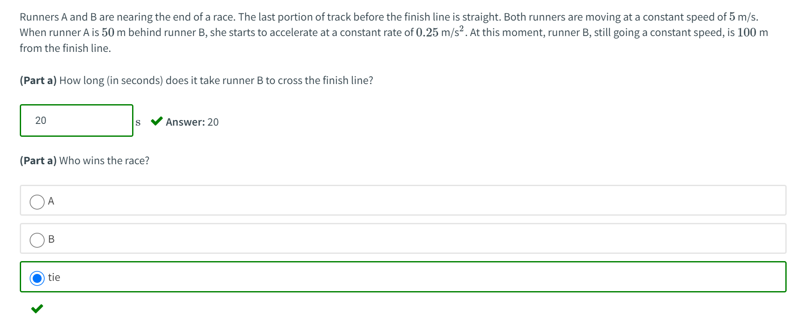

**Key**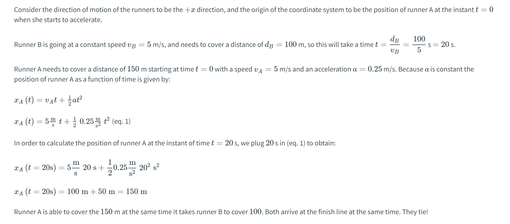

## P2 射击苹果
> 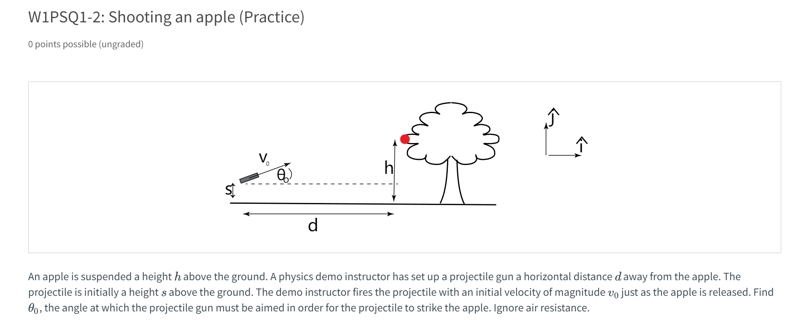

**Key**如果要射中苹果，必须满足子弹在水平方向运动$d$的同时竖直方向和苹果高度一致，所以：
$\begin{cases}   v_0cos(\theta_0)t=d\\s+v_0sin(\theta_0)t-\frac{1}{2}gt^2=h-\frac{1}{2}gt^2\end{cases}$
解得$\theta_0=tan^{-1}(\frac{h-s}{d})$

## P3 变加速直线运动
> 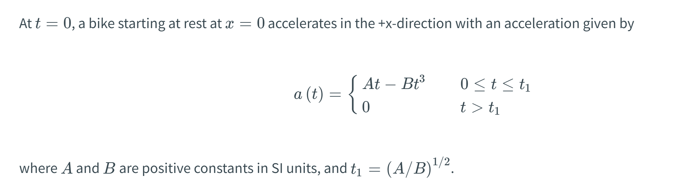

**Part (a)**

**Part (b)**
**Part (c)**
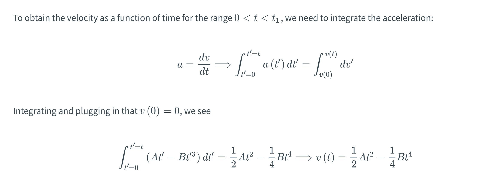
**Part (d)**
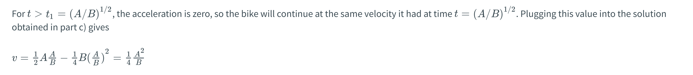
**Part (e)**
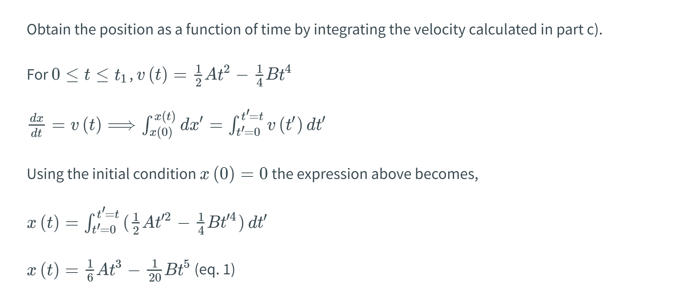
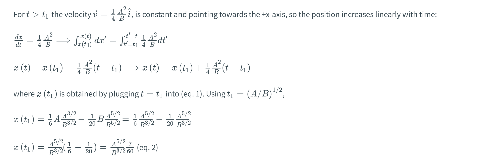
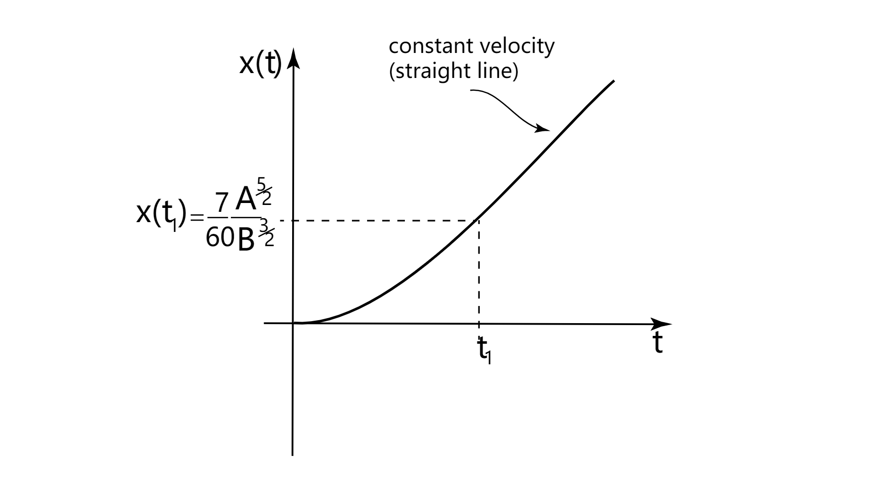

## P4 带有限制的运动
> 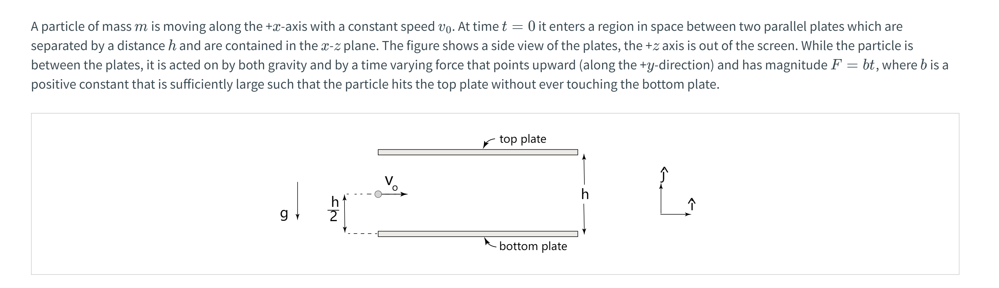

**Part(1)**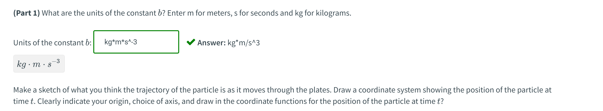
**Part 1 Sketch**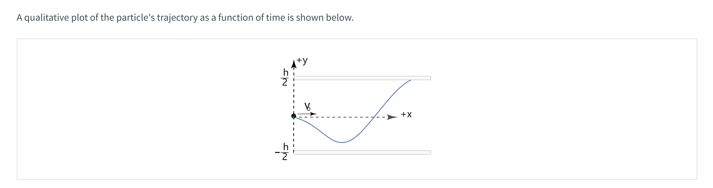
**Part(2)**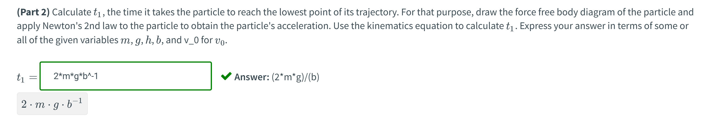
**Part(3)**
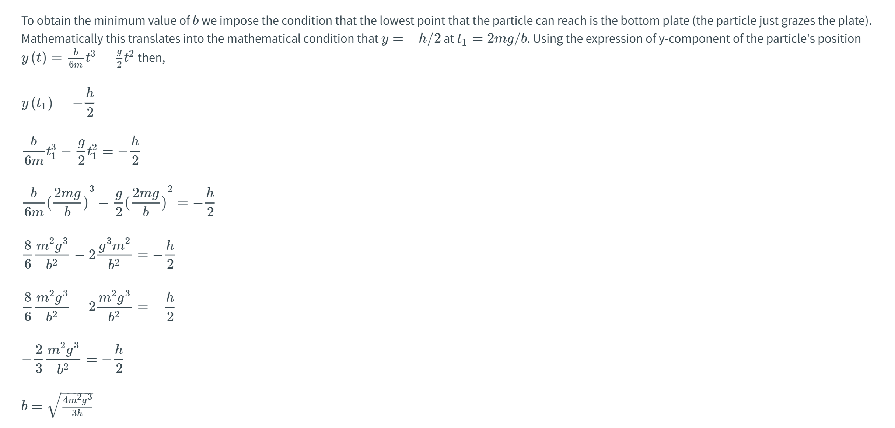

## P5 匀加速运动
> 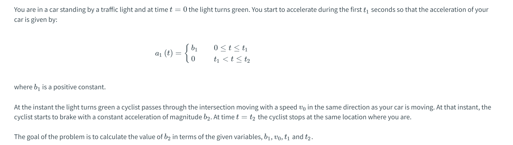

**Part(a)**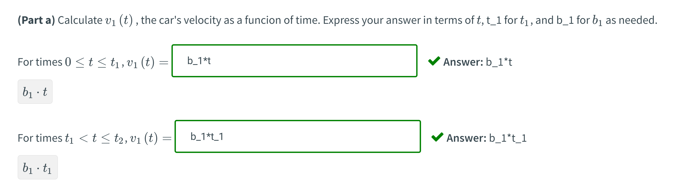
**Part(b)**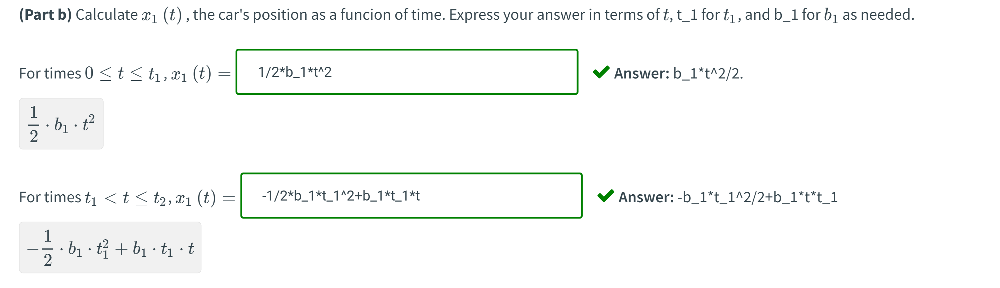
**Part(c)**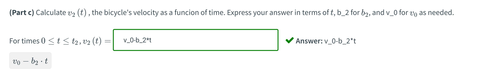
**Part(d)**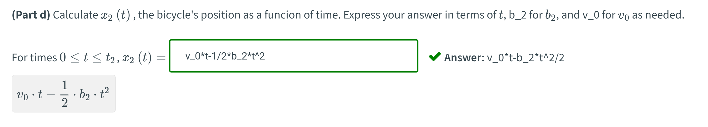
**Part(e)**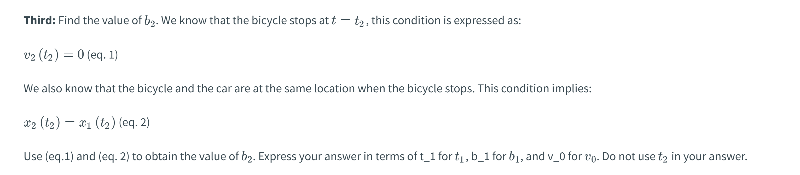
根据$(b),(d)$问，我们有$v_0t_2-\frac{1}{2}b_2t_2^2=-\frac{1}{2}bt_1^2+b_1t_1t_2$, 同时$t_2=\frac{v_0}{b_2}$
于是$\frac{v_0^2}{b_2}-\frac{1}{2}b_2(\frac{v_0}{b_2})^2=-\frac{1}{2}bt_1^2+b_1t_1\frac{v_0}{b_2}$
于是化简得$b_2=\frac{2b_1t_1v_0-v_0^2}{bt_1}$。
