[chapter08_applications_newtonslaws_v17.pdf](https://www.yuque.com/attachments/yuque/0/2022/pdf/12393765/1662005479314-8564d217-31e5-40ac-9482-4a44942ff9b1.pdf)
> **Readings:**
> ** **

# 1 Force Laws
## 1.0 前言
> 有些力在很短的时间内不会有明显的变化，我们称这些力为时间恒定力。还有些力随着质点在空间中移动不会发生改变，我们称这些力为空间恒定力。地球表面附近物体的引力就是空间恒定力的一个例子。
> 还有些力取决于物理系统的参数。当一个质点固定在弹簧的一端，作用在物体上的弹簧力会随着弹簧长度的伸长或者缩短而增加。
> 还有些力在空间中扩散，随着距离的增加而减少。常见的例子是引力和电场力。两个物体之间的引力与两个物体之间的距离的平方成正比。当然我们也有其他的类似的力, 他们会和常数、$\frac{1}{r}$ ，$\frac{1}{r^2}$，$\frac{1}{r^3}$成正比。
> 一个力的大小可能保持不变，但方向会改变；例如作用在围绕恒星做圆周运动的行星收到的引力是恒定的，方向随时变化，但一直向内指向恒星，这种物体间的吸引力的中心力称为**向心力**(`**Centripental Force**`)。
> `**Force Law**`**描述了力和物体属性之间的关系。**
> 本章我们将看到一些相互作用可以用`**Force Law**`**来描述**， 但其他的相互作用不能用`**Force Law**`来描述。

## 1.1 胡克定律
> 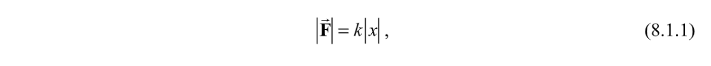
> 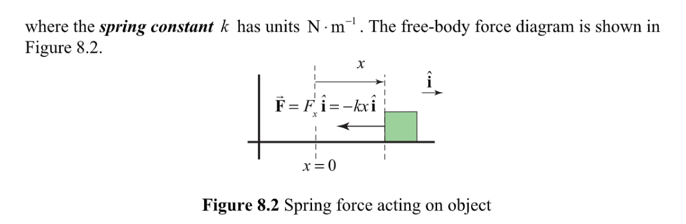
> 
> 我们可以通过胡克定律测得弹簧上的`Restoring Force`, 然后使用牛顿第二定律来预测绑在弹簧一端的惯性质量为$m$的物体的加速度大小：
> 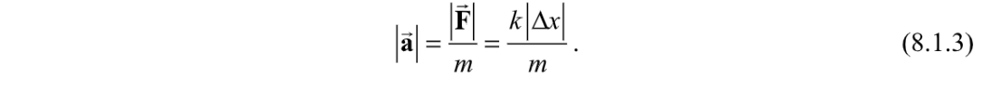

**图解**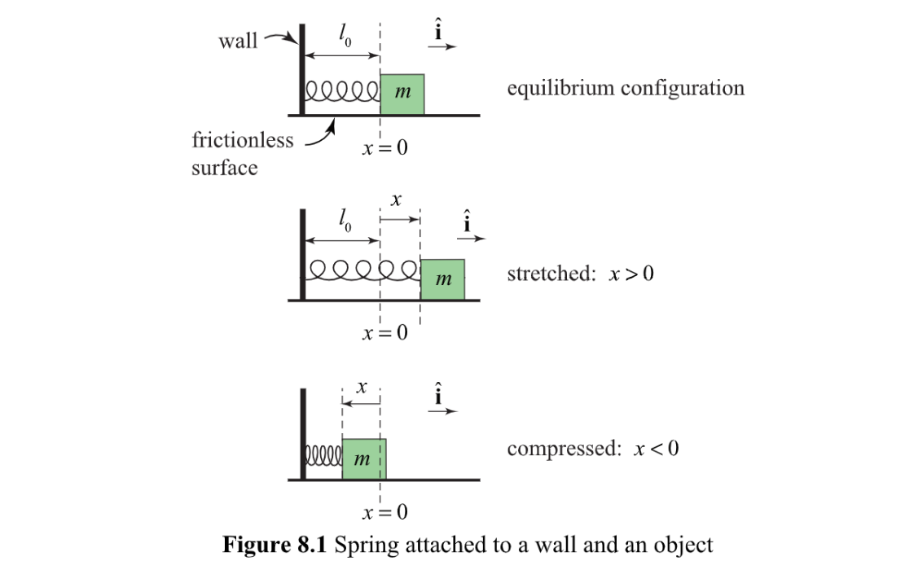

## 1.2 Pre-tension
> 就是弹簧比较卡的情况，可能需要额外的力来使得弹簧拉伸或者缩短到相同的长度。
> 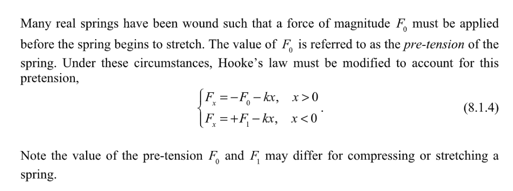

## 1.3 Mini Quizzes
> 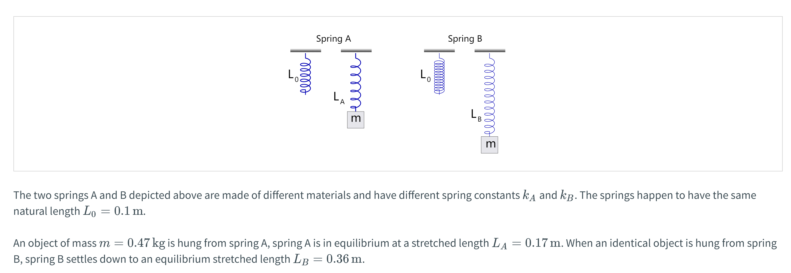

**Key**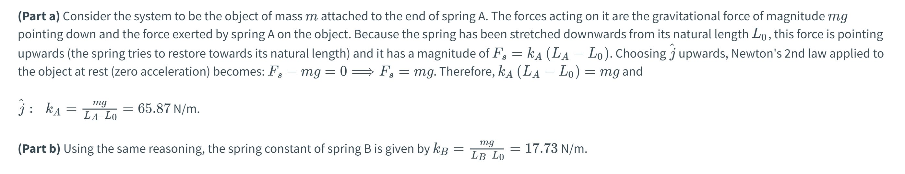

# 2 Fundamental Laws of Nature
## 2.0 前言
> `Force Law`是物理过程背后依赖的数学模型。它们源于观察和实验，但适用范围有限。
> 比如，弹簧的`Linear Force Law(**Hooke's Law**)`是否适用于所有弹簧？毕竟每个弹簧的`Spring Constant`很可能有不同。所以描述弹簧的`Force Law`仍然缺乏通用性。因此，将某个弹簧的物理模型不能直接推广到所有弹簧上去，除非弹簧的某些内在底层属性，对所有弹簧通用的，此时才可以说我们找到了一个通用的描述弹簧受力行为的`Force Law`。
> 也许弹簧是由非常小的部件组成的，当它们被拉开时，它们往往会收缩在一起。这表明当弹簧分子被拉开时，存在某种类型的分子间作用力使它们收缩。那么是什么将分子结合在一起？
> 我们能否找到足以解释宏观`Force Law`的原子间相互作用的基本力？对这种基本力的寻找也是物理学的核心任务。
> 就弹簧而言，寻找这种通用的基本力需要我们对构成弹簧的原子的成分和结构特性进行探究。同时也需要研究原子晶格的几何性质，并确定是否存在创建该晶格的原子的某些基本性质。然后我们问这个晶格在变形下有多稳定，这可能需要对原子的电子布局的探究以及电子/原子如何形成化学键的探究。这些粒子带有电荷，所以这些电荷遵循库仑定律，但也遵循量子力学。所以为了得到对弹簧的`Elastic Restoring Properties`，我们需要找到胡克定律底层的`fundamental physics`。

## 2.1 万有引力定律
> 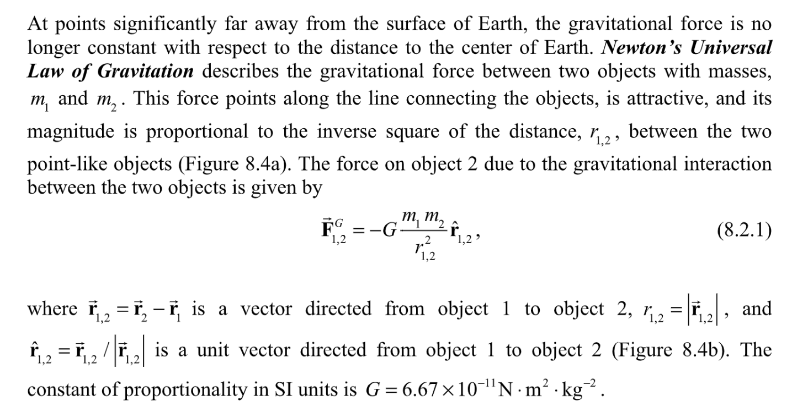
> **引力的几个特性:**
> 1. 是吸引力，方向指向双星系统内部。
> 2. 大小与双星系统各自的质心连线的直线距离成平方反比。
> 3. 引力常数$G$大小固定，其`SI Units`是$N\cdot m^2\cdot kg^{-2}$
> 
**相等性定律:**
> 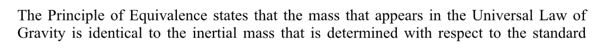
> 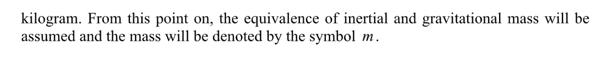
> 两个星球的惯性质量等于其引力质量(上面公式中的$m_1,m_2$)。
> **万有引力定律符合牛顿第三定律:**
> 我们发现，$m_1$对$m_2$的吸引力和$m_2$对$m_1$大小相同，方向相反。
> 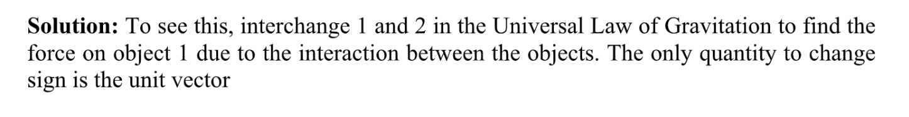
> 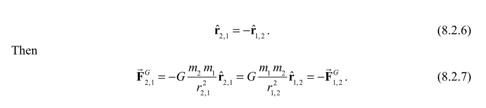

**图解双星系统**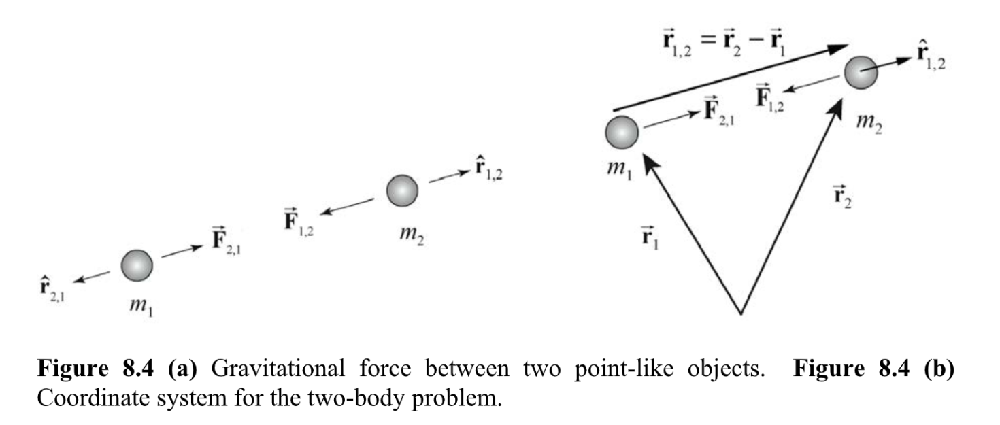
**练习1**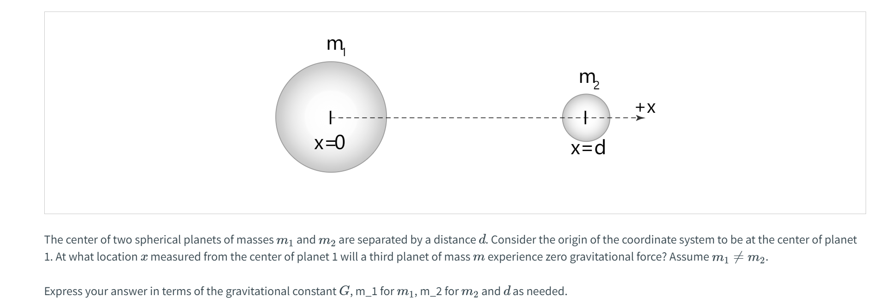
根据万有引力定律，小球一定在$m_1$和$m_2$之间，所以:
$-G\frac{m_1\cdot m}{r_{1,3}^2}\hat{r_{1,3}}+(-G\frac{m\cdot m_2}{r_{3,2}^2}\hat{r_{3,2}})=0$
于是$\frac{r_{1,3}}{r_{3,2}}=\sqrt{\frac{m_1}{m_2}}$
因为$r_{1,3}+r_{3,2}=d$, 所以$k=\frac{ d}{\sqrt{m_1}+\sqrt{m_2}}$
所以$x=\sqrt{m_1}\cdot k=\frac{\sqrt{m_1}\cdot d}{\sqrt{m_1}+\sqrt{m_2}}$
**练习2**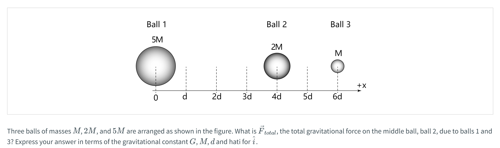
根据万有引力公式: $\vec{F_{total}}=\vec{F_{1,2}^G}+\vec{F_{3,2}^G}=-G\frac{5M\cdot 2M}{16d^2}\hat{i}+G\frac{2M\cdot M}{4d^2}\hat{i}\newline=-\frac{1}{8}\cdot G\cdot\frac{M^2}{16d^2}\hat{i}$

## 2.2 地表引力估计
> 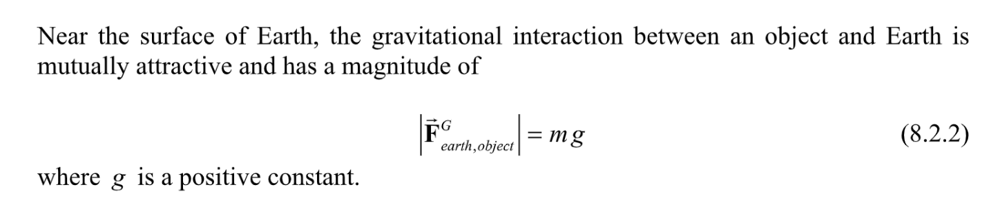
> 国际度量衡委员会已经采用了以下标准值 $g = 9.80665 m \cdot s^{-2}$作为物体在真空中自由下落的加速度标准值。$g$的实际值随海拔高度和纬度的变化而变化。如果$φ$表示纬度，$h$ 是海拔高度（$m$），那么用`SI`单位表示的重力加速度是 
> $g = (9.80616- 0.025928cos(2φ) + 0.000069cos^2 (2φ) - 3.086 ×10-4 h)$, 单位是$m\cdot s^{-2}$
> 这就是所谓的`Helmert’s equation`。由这个公式, 我们可以知道:
> - 在$42\degree$纬度上，标准千克的引力强度为$9.80345 N⋅kg^{-1}$，所以所有在海平面上的物体重力加速度为$g = 9.80345 m⋅s^{-2}$。
> - 而在赤道上 $g = 9.78m⋅s^{-2}$，在两极$g = 9.83m\cdot s^{-2}$。
> 
以上差异主要是**由于地球的自转**，因为地球的自转相当于给地球表面的物体带来了一个虚构的排斥力，影响了方程$(8.2.2)$中$g$的确定，同时因为地球是一个椭球体而不是一个标准球体。（在赤道上与地球中心的距离比在两极的距离要大大约$26.5$公里）。
> **当然我们也可以使用万有引力定律来得出**$g$**的近似大小:**
> 因为$mg=G\frac{mM_E}{R_E^2}$, 所以$g=\frac{GM_E}{R_E^2}$(假设地球是圆的)
> 但是引力的大小和方向也都的变化也会取决于当地的地表特征，这在勘探石油、调查地下水位、以及在勘探和调查的过程中是非常有用的。
> $g$的这种变化可以用一个敏感的弹簧天平来测量。在过去的二十年里，人们对局部重力系数变化进行了大量研究，试图发现一个假想的力，它将比重力更大，同时与物体之间的距离成平方反比。

**练习1**使用$g=\frac{G\cdot M}{R^2}$即可
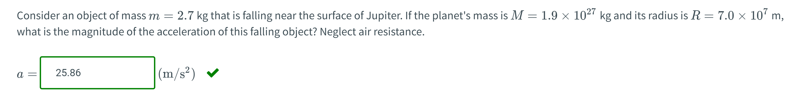
**练习2: 地表引力估计**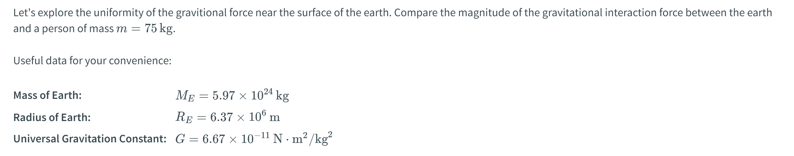

## 2.3 电荷与库伦定律
> 物质具有质量以外还有其他属性。物质也可以携带两种类型的可观察电荷，正电荷和负电荷。同性相斥，异性相吸。在国际单位制中，电荷的单位被称为库仑[`C`]。
> 自然界中已知最小的**自由电荷**是**电子或质子的电荷**。其量级为:
> 实验表明，普通物体所带的电荷是这种**自由电荷的大小的整数倍**量化的。电子携带一个单位的负电荷（$q_e = -e$），质子携带一个单位的正电荷（$q_p = +e$）。在一个孤立的系统中，电荷总量保持不变；在一个封闭的系统中，一定量的不平衡数量的正负电荷既不能产生也不能消灭。电荷只能从一个物体转移到另一个物体。
> 考虑两个点状物体，其总电荷量为$q_1$和$q_2$，在真空中相隔一段距离。在真空中。根据实验观察，如果这两个物体都带正电或负电，它们就会相互排斥。都带正电或负电（图$8.4a$）。如果它们带有相反电荷，就会互相吸引（图$8.5b$）。带电荷物体之间的作用力由库伦定律描述。
> 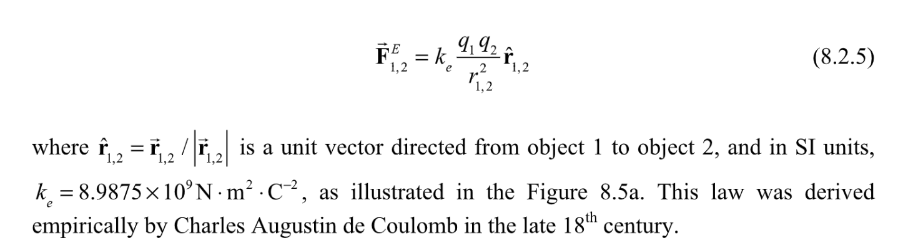
> **电荷力的几个特性:**
> 1. 同性相斥，异性相吸。
> 2. 大小与电荷的之间连线的直线距离成平方反比。
> 3. 电荷常数$k_e$大小固定，其`SI Units`是$N\cdot m^2\cdot C^{-2}$
> 
**库伦定律符合牛顿第三定律:**
> 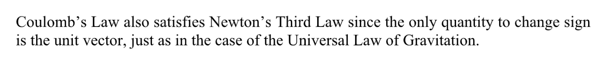

**图解**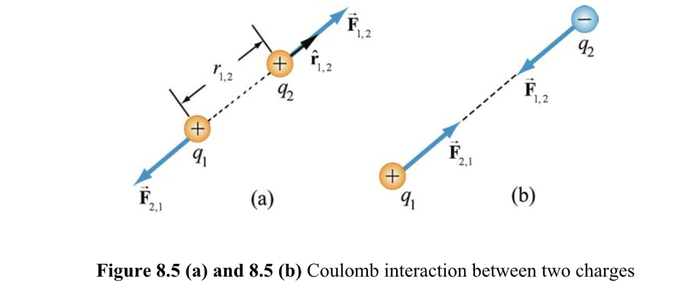

# 3 Constraint Forces
## 3.0 前言
> 牛顿第二定律常用于分析和预测一个物理系统中的物体受到的外力和内力，这些内力和外力确定一系列运动方程。这些运动方程不一定是孤立的，`self-contained`的，而是可能受到一些约束方程的限制。同时这些`Constraint Forces`是由物体的运动的影响决定的，并且这些力中的大多数我们事先是不知道或无法用某种`Force Law`来描述。
> 例如：一个物体在斜面上滑动的物体被约束在斜面上沿着斜面的表面移动。( 图$8.6a$），该斜面对物体施加了一个`Contact Force`；如果一个物体沿着球体表面滑下，到它掉下来之前，都会受到一个球体表面给它的一个`Contact Force`，直到它与球体表面失去接触为止( 图$8.6b$）；密封容器中的气体粒子被限制在容器内无法逃逸，因此容器壁必须对气体分子施加力对的作用使得这些气体分子保持在容器内（$8.6c$）；一个珠子被约束着向外滑动，沿着旋转的杆子向外滑动。杆对珠子的作用力随时间的变化而变化（$8.6d$)。我们将介绍一些方法来确定这些约束力，尽管有许多例子中的约束力是无法确定的。

**图解**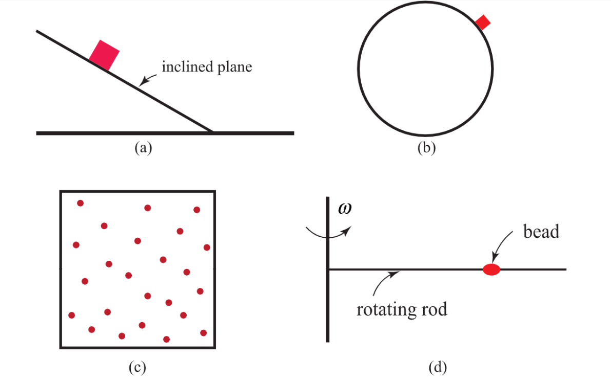
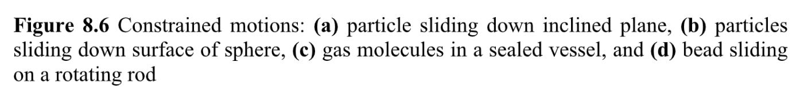

## 3.1 Contact Forces
### 3.1.1 定义
> 推、举和拉是我们在日常生活中经历的接触力。 把你的手放在桌子上；构成桌子的分子的原子和你的手互相接触。如果你用力按压桌面，构成桌面的原子和手的原子也会被更加紧密地压在一起。原子中的电子开始相互排斥，你的手就会被桌子推向相反的方向。你的手被桌子推向了相反的方向。根据牛顿第三定律，你的手对桌子的作用力与桌子对手的作用力大小相等，方向相反。
> 将你的手按压桌面的同时沿着桌子的表面轻轻向前滑动。你几乎感觉不到桌子在往上推，但你确实感觉到摩擦力对你的手的运动起到了阻碍作用。这个力的作用与表面相切，与你的手的运动相反。
> `**Contact Force**`**的定义与示意图:**
> 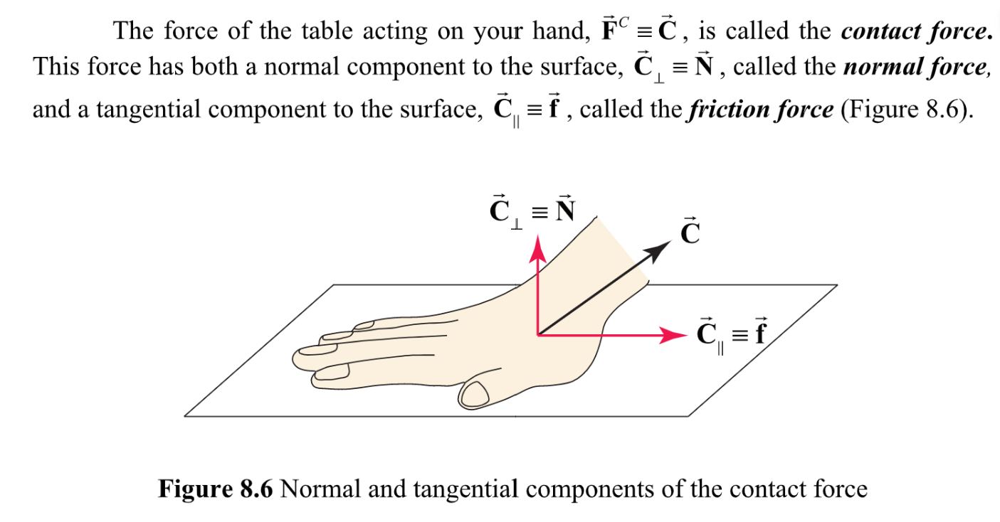
> 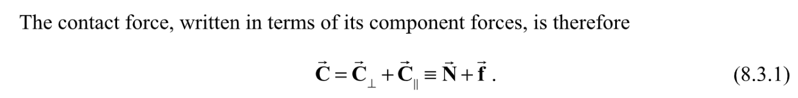
> 任何力都可以分解为水平分量和法向分量。接触力是一个`Distributive Force`，分布于手与桌面的接触**面**上。
> 在大多数应用中，我们将把接触力视为作用在一个**点**上，但当接触力的分布性质对我们研究刚体运动起关键作用时，就必须采取一些措施。
> **对手掌受力分析:**
> 需要记住的一点是，接触力的两个分量的大小取决于我们的手有多么用力地在挤压桌面，以及向着什么方向挤压。的两个分量的大小取决于你推或拉你的手的力度和方向。约束力的分量（大小和方向）无法直接使用`Force Law`来确定，而是只能通过物体的运动状态来间接推断出来。
> 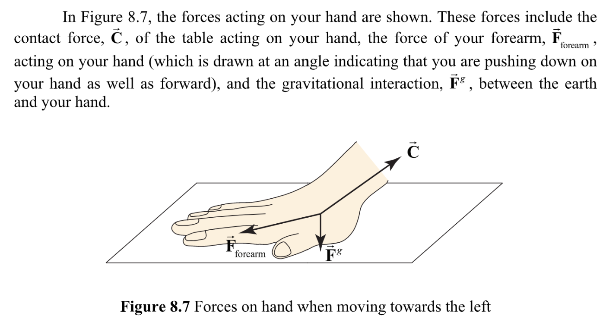

### 3.1.2 接触力的竖直分量(支持力)
> 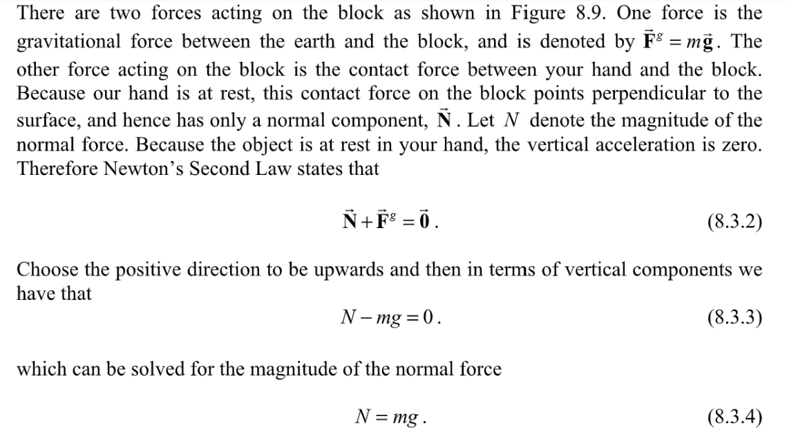

**图解**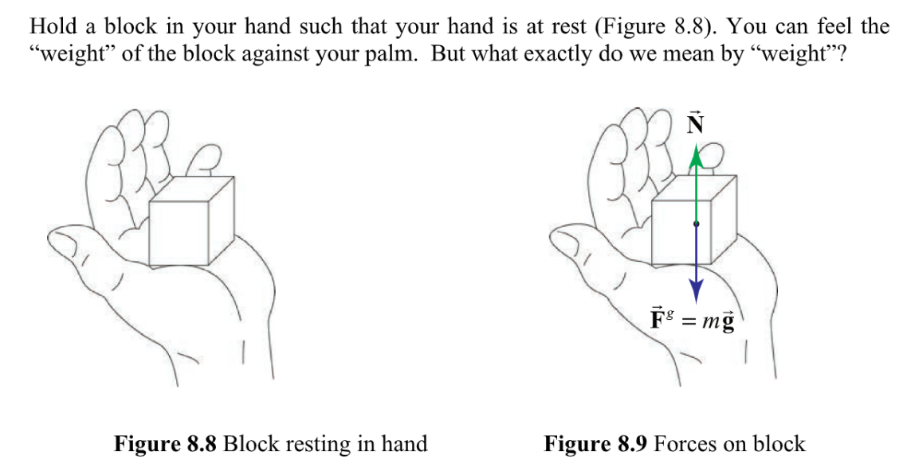
当我们谈论木块的 "重量 "时，我们通常指的是木块在秤上的数值，或者是我们用手拿着木块时的感觉。这些效果实际上是法向力的影响。如果有一个额外的力在支撑着木块, 我们说一个木块 "感觉更轻了"。例如，你可以把木块放在你的手上, 但用你的另一只手对木块施加一个向上的力，使它在你支撑的手上感觉更轻。
实际上"重量"这个词经常被用来描述地球对物体的吸引力。我们将永远把这个力称为引力，而不是 "重量"。当你在空中跳跃时，你感到 "失重"，因为没有除了重力外的力作用在你身上。
> 支持力和引力一般不会成对出现，因为他们不遵循牛顿第三定律，比如物体虽然在我们的手掌上，但是有一个微小的向上的加速度，此时支持力和引力虽然方向相反，但是大小却不同。

### 3.1.3 内力与外力
> 让我们把我们的系统重新定义为木块，手掌，和地球组成的一个整体。那么法向力和引力现在就都是我们定义的这个系统中的内力，我们现在可以尝试确定这个系统中各种相互作用的力对。例如，我们可以研究**木块和地球**之间的相互作用,  让$\vec{\mathbf{F_{E,B}^g}}$ 表示地球对木块产生的引力，$\vec{\mathbf{F_{B,E}^g}}$表示木块对地球产生的引力。根据牛顿第三定律，$\vec{\mathbf{F_{E,B}^g}}=-\vec{\mathbf{F_{B,E}^g}}$, 这地球和木块之间的两个力形成了一个相互作用的一对。请注意，这两个力是作用在不同的物体上的，分别是木块和地球。
> 再例如, 我们可以研究**手掌和木块**之间的相互作用, 记为$\vec{\mathbf{N_{H,B}}}=-\vec{\mathbf{N_{B,H}}}$。
> 再例如, 我们可以研究**手掌和地球**之间的相互作用, 记为$\vec{\mathbf{F_{H,E}^g}}=-\vec{\mathbf{F_{E,H}^g}}$。
> 由于我们没有将`Forearm`对手掌的力$\vec{\mathbf{F_{F,H}}}$包括在我们系统中，于是$\vec{\mathbf{F_{F,H}}}$实际上是我们定义的这个系统的外力。如下图所示:

**图示**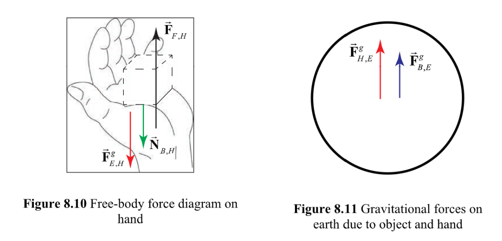

## 3.2 滑动/静摩擦力
> 当一个木块沿水平面被拉动或从斜面上滑下时，有一个沿着面的力阻止其运动。而如果木块在斜面上处于静止状态，仍有一个力阻碍运动。这种阻力被称为`**Dry Friction**`。
> `**Dry Friction**`有两种不同的类型。第一种类型是当两个物体相对运动时；这种情况下的摩擦力被称为动摩擦力或滑动摩擦力`**Kinetic Friction/Sliding Friction**`。当两个表面不移动，但块在斜面上静止时，仍有一个沿着表面的阻力，这种力称为静摩擦力`**Static Friction**`。

### 3.2.1 滑动摩擦力
> 达芬奇最早记录了在`1493-4`年和`1515`年左右记录了滑动摩擦力的大小，并发现了滑动摩擦力的前两个性质:
> 1. 滑动摩擦力的大小是$f_k=u_kN$, $u_k$是滑动摩擦系数, $N$是物体受到来自接触面表面的支持力，所以物体受到的摩擦力和物体的重力成正比。
> 2. 滑动摩擦力和接触面积大小无关。
> 3. 滑动摩擦力和物体沿着接触面的运动速度无关(**库伦**发现的)。
> 
同时，滑动摩擦力和物体相对于接触面的运动方向相反, 看到`begin to move`就可以表明是滑动摩擦力。
> 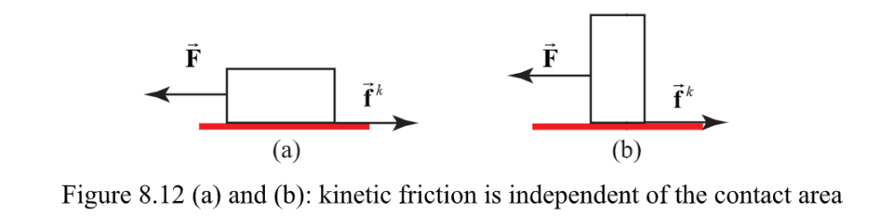
> 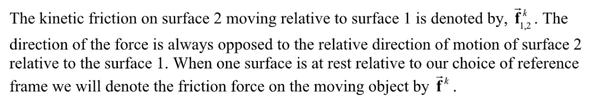

### 3.2.2 静摩擦力
> 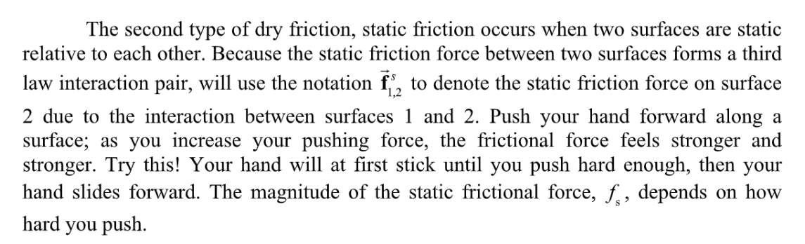
> 物体在被推动之前的静摩擦力满足：
> 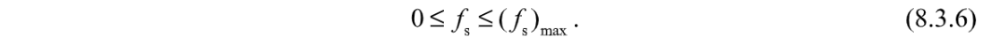
> 
> 1. 静摩擦力的大小是$f_s=u_sN$, $u_s$是静摩擦系数，一般$u_s>u_k$
> 2. 静摩擦力和接触面积大小无关。
> 3. 静摩擦力和物体沿着接触面的运动速度无关。
> 
静摩擦力和物体相对于接触面的相对运动趋势相反。
> 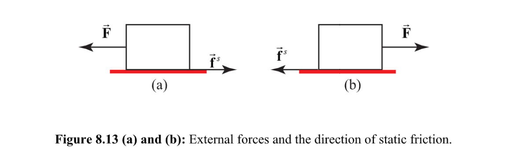

## 3.3 Friction at the NanoScale
:::info
**Video Clip:** [https://openlearninglibrary.mit.edu/courses/course-v1:MITx+8.01.1x+3T2018/courseware/week:week2/ls:wk02_dd_friction/?child=first](https://openlearninglibrary.mit.edu/courses/course-v1:MITx+8.01.1x+3T2018/courseware/week:week2/ls:wk02_dd_friction/?child=first)
:::
### 3.3.1 Atomic Layer Wearing
> 微观上的摩擦力有一些不好的性质，比如他会导致$3\%$的`GDP`浪费在了和摩擦力的对抗上**：**
> 我们考虑一个在路面上滚动的轮胎（半径为$R$），轮胎以每$50000km$$10mm$的速度沿着径向磨损(`1 Atom Layer`是$10^{-10}m$)。
> 根据以上信息，我们知道$10mm=10^8$层`Atomic Layers`。我们还知道轮胎每转动一圈，就会行驶$2\pi R\approx 1m$, 而$50000km=5\cdot10^7=5\cdot 10^7$圈，
> 所以轮胎每转一圈，都会脱落大约$\frac{10^8}{5\cdot 10^7}\approx 2$层`Atom Layers`

### 3.3.2 Experiments at nanoscale
:::info
如何对一个物体和接触面建模呢？
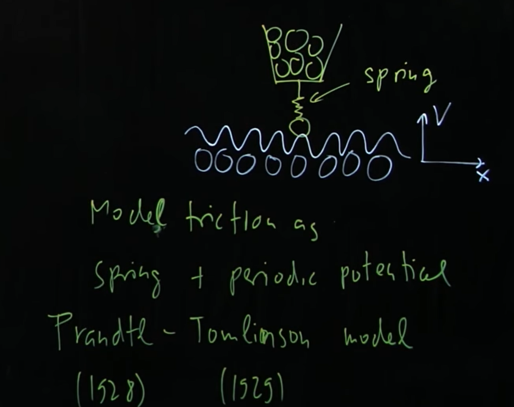
:::

# 4 Free-body Diagram
## 4.1 System
> 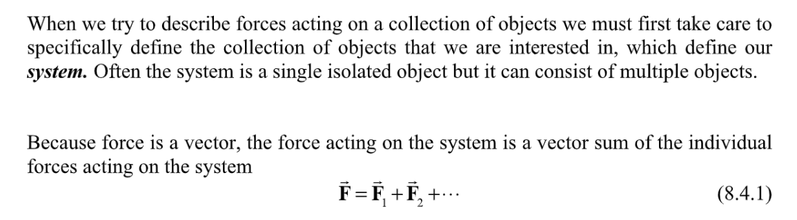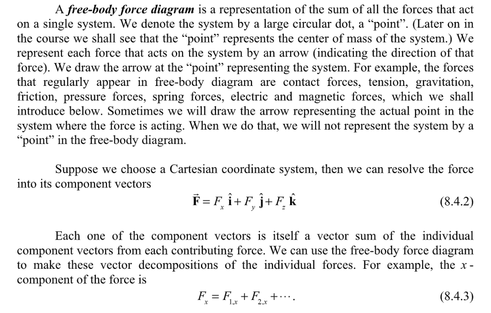
> 本质是整体法和隔离法分析物体受力情况。

## 4.2 无重量绳子上某一点的受力
> 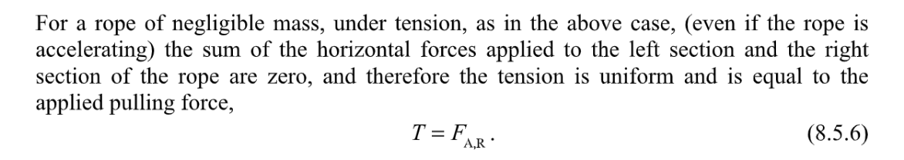
> **绳子无质量，即使它在加速，它每一点的受力都是相同的(可以忽略加速度)。**

**推导**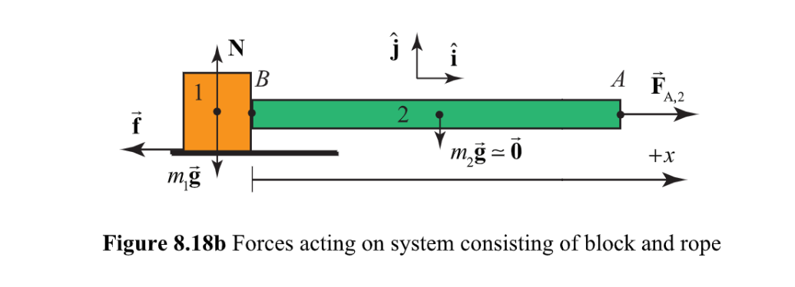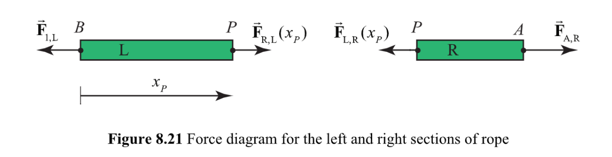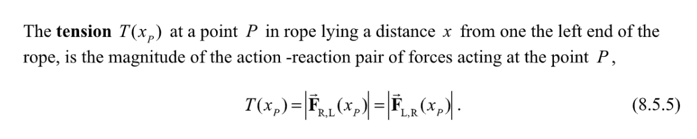

## 4.3 有重量绳子上某一点的受力
> 假设绳子有质量$m_2$且匀质。一旦绳子有了重量，我们就可以把它当做一个常规物体来看待，即绳子的不同部分的拉力是不同的。
> 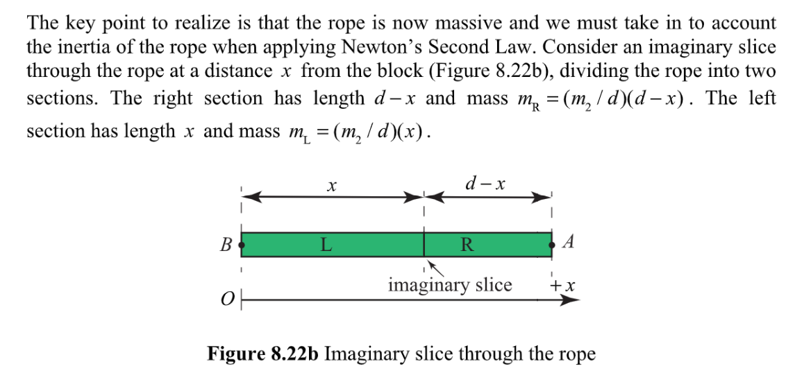
> 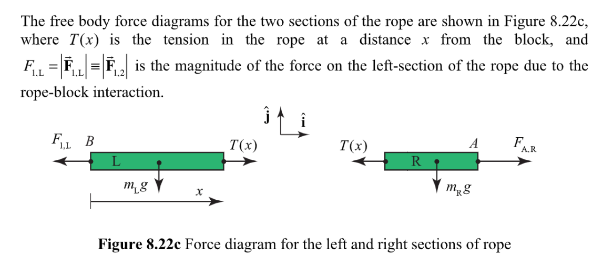
> **对**$L,R$**分别使用牛顿第二定律:**
> 
> 接下来我们使用两种方式求出$T(x)$

### 4.3.1 隔离法
> **对木块进行受力分析:**
> 
> 然后代入$(8.5.8)$:
> 
> 因为木块和绳子是一起移动的，所以$a=a_L=a_R$得到:
> 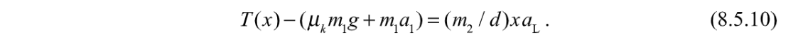

### 4.3.2 整体法
> **对木块和绳子的整体受力分析:**
> 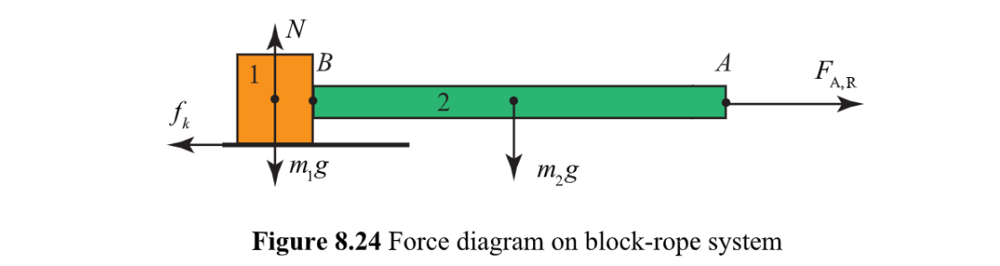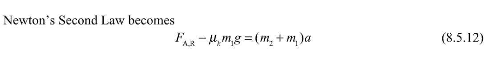
> 然后代入$(8.5.7)$:
> 
> 因为木块和绳子是一起移动的，所以$a=a_L=a_R$得到:
> 

### 4.3.3 总结
> **有质量的绳子在不同位置处的张力是不同的, 需要受力分析(不可忽略加速度)。**

## 4.4 Suspended Rope
> 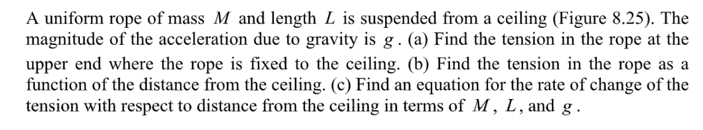

**图示**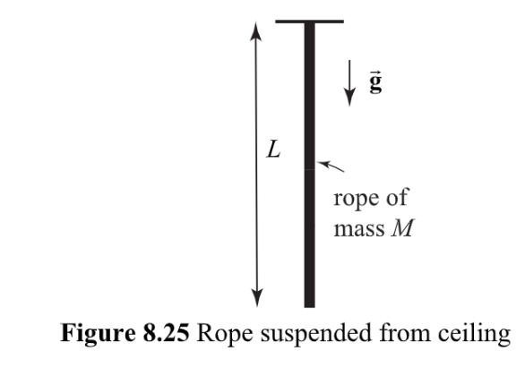
**(a) Tension at the top**建立坐标系，$y$轴正方向竖直向下：
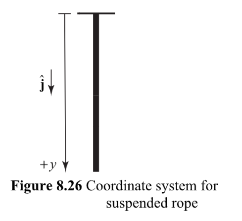
对绳子受力分析:
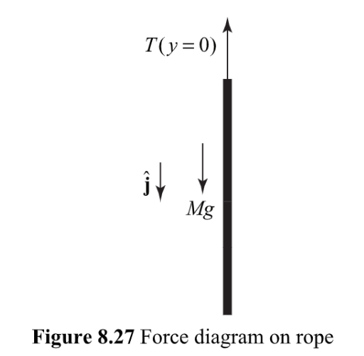
根据牛顿第二定律: $Mg-T(y=0)=ma=0$
所以$T(y=0)=Mg$
**(b) Tension at any point**
对上半部分(长度为$y$)进行受力分析, 同时根据牛顿第二定律:
$T(y)+m_1g-T(y=0)=m_1a=0$
因为绳子是匀质的，所以$m_1=\frac{M}{L}y$，也就是:

**(c) Rate of Change of the tension**对$(b)$问中的$(8.5.14)$求导, 得到：


## 4.5 Mini Quizzes
### Q1 Free-body Diagram 1
> 

**Key**最大和最小力分别对应与静摩擦力朝上和朝下的情况。


### Q2 Free Body Diagram 2
> 

**Key**

### Q3 剪断绳子
> 
> **自由落体**

# 5 Pulley Systems
## 5.1 Pulley System Analysis
> 滑轮装置是非常重要的物理系统，下面我们对其进行完整的分析。
> 

**(a) 加速度关系分析**本题绳子不可伸长是关键，这直接导致了绳子两端连接着的物体的加速度满足一定的比例关系。

**(b) 受力分析图****本题绳子无质量也是关键，因为这样的话同一根绳子上的张力的大小是处处相同的**。

于是我们可以对物体$1,2,3$以及滑轮$P$做受力分析:

**(c) 求解加速度****对物体**$1$**使用牛顿第二定律:**

**对物体**$2$**使用牛顿第二定律:**

**对物体**$3$**使用牛顿第二定律:**

**对滑轮**$P$**使用牛顿第二定律:**

**将上述方程收集起来:**

**求解, 得到:**

1. **物体**$1$**的加速度**

2. **物体**$2$**的加速度**


3. **物体**$3$**的加速度**

4. **绳子**$A$**上的张力**

5. **绳子**$B$**上的张力**

## 5.2 Mini Quizzes
### Q1 受力分析
> 

**Key**

### Q2 受力分析
> 

**Key**

# 6 Skill Challenge: Newton's 3rd Laws
## Q1 Book on a table
> 

**Solution**

## Q2 Pushing Two Blocks
**Question**
**Solution**

## Q3 Pushing a Safe
**Question**
**Solution**

## Q4 Horizontal Blocks
:::info

:::
**Solution**

## Internal and External Forces
:::info

:::
**Example - Different Choice of System**


## Q5 System and External Forces 
:::info

:::

## Q6 Applying Newton's 2nd Law
:::info

:::
**Solution**

# 7 Problem Solving Practice 
## Atwood Machine: Blocks FBD
:::info

:::

## Sliding Block
> 

## Window Washer Problem
> 
> [Video Analysis](https://openlearninglibrary.mit.edu/courses/course-v1:MITx+8.01.1x+3T2018/courseware/week:week2/ls:ls_02_06/?activate_block_id=block-v1%3AMITx%2B8.01.1x%2B3T2018%2Btype%40sequential%2Bblock%40ls%3Als_02_06)

### Part a Identify Forces
> 

### Part b Free Body Diagram
> 

### Part c Choose a system
> 

### Part d  Calculate Forces
> 

