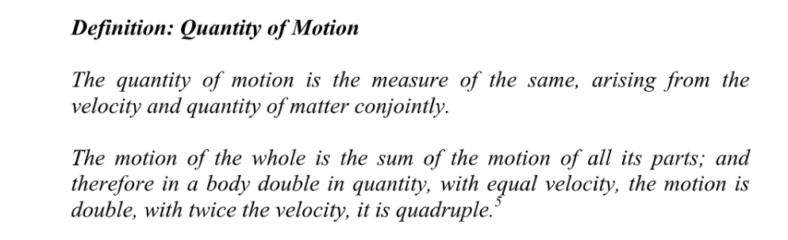
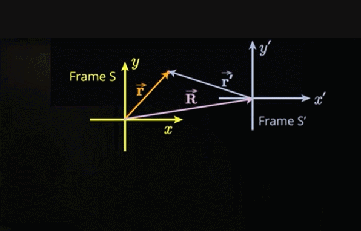

[Chapter07 Newton's Law.pdf](https://www.yuque.com/attachments/yuque/0/2022/pdf/12393765/1662005646582-0509d2aa-d5dc-4fb0-941e-da6498453ec2.pdf)

# 0 质量
> 在我们的日常生活中，我们可以通过推或拉来使身体移动身体。普通语言将此动作描述为一个人的力量或力的作用的结果。然而，放置在斜面上的物体，或在静止状态下释放并自由落体的物体，无需任何推或拉即可移动。伽利略提到了作用于这些物体是力。
> 1623 年，他在《力学》杂志上发表了对这些物体的描述。1687 年，艾萨克·牛顿在自然哲学的数学原理” 上发表了他的三个运动定律，扩展了伽利略的观察。第一定律表达了当没有力作用在物体上时，它会保持静止或保持匀速运动；当对物体施加力时，它会改变其运动状态。许多科学家，尤其是伽利略，在牛顿之前认识到力产生运动的观点，但牛顿将力的概念扩展到任何能够产生加速度的东西。
> 当身体最初处于静止状态时，我们推或拉的方向对应于身体的运动方向。如果身体本身就在移动，那么施加的外力可能会**改变**身体的**运动方向**和**运动速度**移动。牛顿将作用在物体上的力定义为与加速度成正比的对象。
> _外加力是施加在物体上的动作，以改变它的状态，可以是静止的，也可以是直线匀速运动的状态。_
> 为了定义力的大小，牛顿引入了一个比例常数`Constant of Proportionality`，称为惯性质量，牛顿称之为“`Quantity of Matter`"。
> `Quantity of Matter`是由它的密度和体积产生的一个度量。
> 

# 1 力的定义和力的分解
> 假设我们对一个与标准质量相同的物体（我们将此物体称为标准物体）施加一个力。 该力将使标准物体产生一个大小为$|\mathbf{\vec{a}}|$的加速度, 这个加速度可以通过**加速度计**测量得到。
> 作用在标准体上的力$\mathbf{\vec{F}}$的大小$|\mathbf{\vec{F}}|$定义为标准物体的质量$m_s$和其加速度大小$|\mathbf{\vec{a}}|$的乘积
> 力$\mathbf{\vec{F}}$是一个向量，大小我们已经定义过， 为$m_s\cdot |\mathbf{\vec{a}}|$, 方向被定义为和加速度向量$\mathbf{\vec{a}}$一致，
> 为了证明力是一个向量的说法，我们需要在标准物体上同时施加两个力$\mathbf{\vec{F_1}}$和$\mathbf{\vec{F_2}}$, 且这两个里的合力$\mathbf{\vec{F^T}}$是这两个力向量相加的结果。
> 
> 
> 
> 
> 
> 

# 2 Mass Calibration
> 到目前为止，我们只使用标准物体来测量力。 我们可以通过标准物体校准所有其他物体的质量
> 我们将以这种方式测量的质量作为惯性质量(`inertial mass`)并用 $m_{in}$ 表示。
> 假设我们对标准物体施加一个大小为 $F$ 的力并测量其加速度 $a_s$ 的大小。 然后我们对第二个未知质量为 $m_{in}$物体施加相同的力$F$，并测量其加速度$a_{in}$ 的大小。 因为相同大小的力作用于两个物体，所以：
> 
> 
> 
> 这种方法的合理性在于我们可以使用不同大小的力重复实验，并发现加速度$a_s$与$a_{in}$的比率总是相同的。 为简单起见，我们将用 $m$ 表示一个物体的惯性质量。

# 3 牛顿第一定律
> 牛顿第一运动，通常称为“惯性原理”，首先被伽利略验证。 （牛顿没有承认伽利略的贡献。）牛顿特别关注如何用拉丁语表达第一定律，但经过多次重写牛顿为第一定律选择了以下的表达形式：
> 
> 牛顿第一定律是关于物体运动的实验陈述。**当一个物体以恒定速度运动，要么没有外力施加于其上，要么所有施加于其上的外力的总和为零。如果物体的速度发生了改变，它有非零加速度，因此作用在物体上的所有力的总和必须不为零。如果物体的速度随时间变化，那么物体运动方向或大小会发生改变，或者两者都可以改变。**
> 公共汽车或火车启动后，加速度通常很小，我们几乎感觉不到它。我们经常感到吃惊，因为看起来车站好像在后移动，而公交车似乎是静止的。牛顿第一定律指出，没有具体的方法区分是我们是在移动还是车站在移动的，因为作用在他们身上的合力几乎为零。一旦我们达到一个恒定的速度，我们的头脑会很快打消掉地面正在向后移动的想法，因为我们认为它是不可能，但我们没有实际的方法来区分火车是在移动还是在移动地面在移动。

# 4 动量和牛顿第二定律
> 牛顿第二定律从动量的定义开始

## 4.1 动量
> 
> 

## 4.2 牛顿第二定律
> 

> 
> 
> 因为我们用运动的变化来定义力，所以牛顿第二定律似乎对这个定义的重述，因为力只是通过测量加速度而确定，所以我们不能再没有测量出物体加速度的情况下就得到力的大小和方向。将牛顿第二定律从力的定义转变成一个家喻户晓的定律的是来自基于力定律的附加输入对物体之间相互作用的实验观察。在本书中，我们应研究这些力的定律并使用它们以确定作用在物体上的力（牛顿第二定律的左侧）和加速度。
> 当一个物理身体被限制在一个表面上或在一个容器内移动（例如容器中的气体分子），会存在一些通过力的定义不能确定的约束力，但它们可以由物体运动的状态的变化而决定。对于任何给定的约束运动，这些约束力是未知的，必须由我们正在研究的物体的运动特性和状态决定，例如表面对物体的接触力，或壁对气体颗粒的力。
> 牛顿第二定律的右手边是物体的惯性质量的乘以加速度。加速度是对物体速度如何改变的数学描述。一旦我们知道了作用在物体上的所有力，我们就能够预测其加速度。方程$(7.3.5)$ 被称为`Equation of Motion`。一旦我们知道这个方程我们可以通过积分等计算技巧确定物体运动的速度和位移随时间的变化。对于受约束的运动，如果我们知道物体的加速度，我们还可以确定作用在物体上的约束力的大小。

# 5 牛顿第三定律
## 5.1 定义
> 牛顿第三定律说明：力的作用是相互的。
> 
> 第三定律，俗称“`Action-Reaction`”定律，是三定律中最令人惊讶的。 牛顿发现：当两个物体相互作用时，它们各自对彼此施加相同大小但方向相反的力。 我们将两个相互作用的物体之间的力对称为**相互作用力对**，或者更简单地称为**相互作用对**
> 
> 
> 我们将使用这些定义、牛顿三大定律和力的定义来描述物体的运动，这门学科被称为经典力学或牛顿力学，从而解释了范围广泛的现象。 牛顿力学有重要的局限性，它不能令人满意地解释以与光速（$v>0.1c$）相当的速度运动的物体系统，我们需要狭义相对论，也不能充分解释原子中电子的运动，我们需要量子力学。 我们还需要广义相对论和宇宙学来解释宇宙的大尺度结构。

> **需要注意的是：**
> 牛顿第三定律研究的力一定是作用在**两个不同的物体**上的

## 5.2 惯性参考系
> 假设现在我们想描述一个匀速直线运动的质点的运动。
> 我们可以采用一个静止的参考系(称为惯性坐标系)$S$，坐标系本身是不动的，但是质点在里面移动。
> 我们也可以采用一个运动的参考系$S'$(匀速直线运动)
> 
> **这个参考系**$S'$**相对原始参考系**$S$**是匀速直线运动的(参考系**$S'$**受到的外力总和是零), 我们称这样的参考系是惯性参考系。**

**图示**
> 两个参考系的关系如下：
> 
> $\begin{cases}\vec{r}=\vec{R}+\vec{r'}......................(1) \\ \vec{r'}=\vec{r}-\vec{R}......................(2)\end{cases}$, 其中物体在参考系$S$下的坐标用$\vec{r(t)}$表示，在参考系$S'$下的坐标用$\vec{r'(t)}$表示，
> 假设参考系$S'$的速度向量$\vec{V}$的大小是恒定的。
> 参考系中$S'$距离坐标系$S$的位置随时间变化的关系式是$\vec{R}(t)=\vec{R_0}+\vec{V}t$（$\vec{R_0}$是两个参考系初始的位移）
> 我们对$(2)$求导：$\frac{d\vec{r'}}{dt}=\frac{d\vec{r}}{dt}-\frac{d\vec{R}}{dt}$， 所以$\vec{v'}=\vec{v}-\vec{V}......(3)$, 也就是同一个物体在不同的参考系下的速度表示的关系。
> 我们对$(3)$求导: 所以$\frac{d\vec{v'}}{dt}=\frac{d\vec{v}}{dt}-\frac{d\vec{V}}{dt}$, 因为$\vec{V}$是常数向量函数, 所以$\frac{d\vec{v'}}{dt}=\frac{d\vec{v}}{dt}-\frac{d\vec{V}}{dt}=\frac{d\vec{v}}{dt}$, 所以$\vec{a'}=\vec{a}$, 所以在**两个坐标系物体的加速度是相同的。**
> 因为在参考系$S$下，$\vec{F}=m\vec{a}$, 且在参考系$S'$下，$\vec{F'}=m\vec{a'}=m\vec{a}$， 所以物体在这两个参考系下受到的力是一致的。
> 所以我们在描述一个质点的运动时可以采用不同的参考系来描述，只要这些参考系相对静止或者相对匀速直线运动，那么这些参考系中的物体受到的力是一致的。

## 5.3 非惯性参考系
> 有惯性参考系就有非惯性参考系。
> **这个参考系**$S'$**相对原始参考系**$S$**是变速运动的(参考系**$S'$**受到的外力总和非零), 我们称这样的参考系是非惯性参考系。**
> 
> $\begin{cases}\vec{r}=\vec{R}+\vec{r'}......................(1) \\ \vec{r'}=\vec{r}-\vec{R}......................(2)\end{cases}$, 其中物体在参考系$S$下的坐标用$\vec{r(t)}$表示，在参考系$S'$下的坐标用$\vec{r'(t)}$表示，
> 非惯性参考系$S'$的**速度向量**$\vec{V}$**的大小不是恒定的**, **换句话说，参考系**$S'$**相对参考系**$S$**有一个加速度**$\vec{A}$
> 类比上面的推导:
> 参考系中$S'$距离坐标系$S$的位置随时间变化的关系式是$\vec{R}(t)=\vec{R_0}+\vec{V}t+\frac{1}{2}\vec{A}t^2$（$\vec{R_0}$是两个参考系初始的位移）
> 我们对$(2)$求导：$\frac{d\vec{r'}}{dt}=\frac{d\vec{r}}{dt}-\frac{d\vec{R}}{dt}$， 所以$\vec{v'}=\vec{v}-\vec{V}-\vec{A}t......(3)$, 也就是同一个物体在不同的参考系下的速度表示的关系。
> 我们对$(3)$求导: 所以$\frac{d\vec{v'}}{dt}=\frac{d\vec{v}}{dt}-\frac{d\vec{V}}{dt}-\frac{d\vec{A}t}{dt}$, 因为$\vec{V},\vec{A}$是常数向量函数, 所以$\frac{d\vec{v'}}{dt}=\frac{d\vec{v}}{dt}-\frac{d\vec{V}}{dt}-\frac{d\vec{A}t}{dt}=\frac{d\vec{v}}{dt}-\vec{A}$, 此时$\vec{a'}=\vec{a}-\vec{A}$, 所以两个参考系下物体受到的力也不同。
> 所以$\vec{F'}=m\vec{a'}=m\vec{a}-m\vec{A}=\vec{F_{physical}}+\vec{F_{fict}}$, $\vec{F_{fict}}=-m\vec{A}$(这个力$\vec{F_{fict}}$不是物体实际受到的力，而是在非惯性参考系下受到的一个假象的力， **且这个假象力的方向与参考系的加速度方向相反。**)

## 5.4 Mini Quizzes
### Q1
> 
> 人在这个非惯性参考系下受到的除了重力还有电梯地面提供的支持力，所以人的加速度为零。

### Q2
> 

