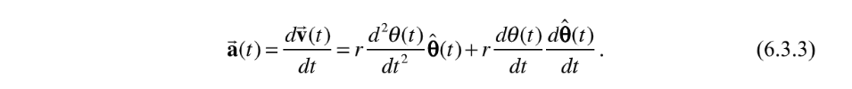
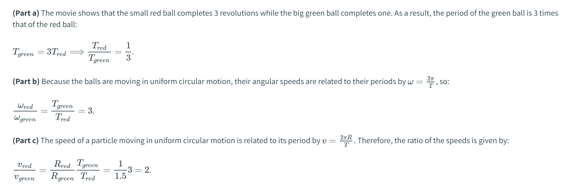

[chapter06_circkin_v09.pdf](https://www.yuque.com/attachments/yuque/0/2022/pdf/12393765/1672321482300-62dab4a3-dd76-41f0-9597-8db16ed4da9f.pdf)
# 1 Velocity and Angular Velocity
## Polar Coordinate
> 

## Position Vectors
> 研究`Circular Motion`我们只需要记住这个图，并对其进行拆解：
> 
> 首先我们尝试描述这个圆周运动的质点的坐标随时间的变化。我们可以选择坐标系，也可以选择`18.02`多元微分中介绍的极坐标系来描述。为了方便起见，我们选择极坐标:
> 1. 在任意时间, 我们`Position Vector`描述质点在时刻的位置，其中我们令为径向的单位向量，所以。
> 2. 在任意时间, 我们有角速率单位向量和正交(垂直)。
> 3. 对任意时间, 与轴的夹角是一个关于的函数，记为。而就是我们熟悉的角速度**大小**，描述单位时间转动的角度(一般是弧度制)。
> 4. 如果我们用和来描述和的话，会得到下面的表达式:
> 

> 我们对`6.2.3`和`6.2.4`求导(运用链式法则)得到:
> 

## Rotating Velocity Vectors
> 从`18.02`中我们知道，`Velocity`(速度)是位移对时间的导数，数学表达式就是:
> 
> 其中:
> 1.  是`Tangential Component of Velocity`。 有正负号，就是圆周运动的半径，恒为正值。
> 2. , 且因为, 所以:
>    1. 如果，则质点做`Counter-clockwise rotation`
>    2. 如果，则质点做`Clockwise rotation`

**Problem 1**
**Problem 2**

## Angular Velocity Vectors
> **首先我们定义**`**Angular Velocity**`**为向量(后面会详细介绍), 且有以下性质：**
> 1. 是`Component of the Angular Velocity`, 有正负号。
> 2. 就是角速率(`angular speed`, 注意不是`angular velocity`，这是角速度)，恒为正值。
> 
然后我们开始研究`Angular Velocity`的方向，首先作为一个`Vector`, 它必须有一个方向，我们规定: 
> 1. 如果质点做`Counter-clockwise rotation`, 则`Angular Velocity`指向平面外部，用表示
> 2. 如果质点做`Clockwise Rotation`, 则`Angular Velocity`指向平面内部，用表示
> 
上面的两个规则被概括为右手定则，四指方向和质点运动方向一致，大拇指方向即为角速度`Angular Velocity`的方向, 我们定义这个方向为(是一个单位向量)。

**Problem**
> [Latex符号参考](https://runebook.dev/zh-CN/docs/latex/math-symbols)

## Geometric Derivation
> 
> **求**`**Magnitude**`**:**
> 
> **求**`**Direction**`**:**
> 

## Practice Problems
### Choosing a Coordinate System
> 

**Part (a)**

**Part (b)**

### Velocity, Angular Velocity and Angular Speed
> 

**Part (a)**
**Part (b)**

# 2 Tangential and Radial Acceleration
## Acceleration Vectors⭐⭐
> 下面我们定义圆周运动的加速度:
> 1. 径向加速度, 
> 2. 法向加速度, 
> 3. 合加速度, 
> 4. 上述表达式中我们有，即我们的系数不一定是常数，而是一个随时间变化的函数。
> 
然后我们尝试给出和的表达式, 我们通过链式法则和`Product Rule`求导得到:
> 
> **所以我们得到了如下的定义:**
> 1. `Tangential Component of the acceleration`:
> 2. `Radial Component of the acceleration`:, 因为, 且, 所以, 这是一个恒小于零的量。⭐⭐⭐

**Problem 1**
**Problem 2**

## Circular Motion Example
> 

**Solution**

# 3 匀速圆周运动的周期和频率
## Basics
> 前文中我们推导出了一般的圆周运动的切向速度，切向加速度，角速度，现在我们对物体的圆周运动施加一定的约束。根据牛顿第二定律，我们知道:
> 1. 质点在切向方向收到的外力之和的大小为，向量为:, 所以 
> 2. 质点在径向方向受到的外力之和为:, 所以
> 
现在假设径向方向照旧，但是切向方向受到的外力为, 则, 此时, 于是我们知道, 因为，所以, 即是一个常数, 所以是一个常值函数。
> 由此我们知道如果质点做匀速圆周运动，则质点遍历完一个半径为的圆周所用的时间是固定的，不妨设为, 称为周期。我们令则我们有成立，于是, 频率是, `SI`单位是, 称为`Hz`。

**Problem **

## Commonly Used Formula
> 对于来说，我们可以用几种不同的公式来表示它:
> 1. , 所以
> 2. 
> 3. 
> 4. 

**Problem 1 **⭐⭐⭐⭐⭐
**Problem 2 **⭐⭐⭐

## Geometric Explanations
> 
> 所以我们发现， 当时，, 且

# 4 Angular Velocity and Angular Acceleration
## Angular Velocity
> 

**Problem **⭐⭐

## Angular Acceleration⭐⭐⭐
> 

**Four Cases **⭐⭐⭐
**Problem 1 **⭐⭐⭐
**Problem 2 **⭐⭐
**Problem 3** ⭐⭐⭐⭐⭐
**我们将提供两种不同的方法:**

1. 从`Angular Acceleration`出发，求两次积分。

因为, 且, 所以, 因为, 所以。然后根据题意, 我们对在上积分，得到

2. 从`Tangential Acceleration`的角度出发，视作一个变加速运动求两次。

根据题意，我们知道切向加速度大小为, 于是根据变加速公式，我们知道
, 于是
然后
**Problem 4 Angular Position from Angular Acceleration **⭐
**Problem 5 Moving around a Circle 符号判断 **⭐⭐
> `**Problem 5**`**中我们可以得到一些比较重要的派生关系:**
> 1. 
> 2. , 即同号，实际上

## Summary of Terminology
> 

# 5 Non-circular Central Planar Motion
> `Non-circular`和`Circular`最大的区别就是不再是常值函数了，而是会随着时间的变化而变化，即。
> 下面我们从开始，推导出, :
> 
> , 于是
> 

**Problem**
